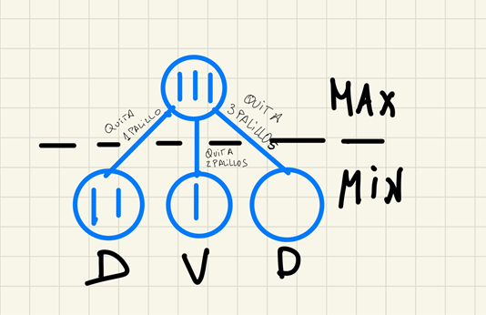

# Cuestionarios IA #
¿Con qué método o métodos de búsqueda se obtienen siempre la solución con un número menor de pasos? Si hay más de uno marcarlos todos.
* **Descenso iterativo.**
* **Búsqueda en anchura.**
* Búsqueda en profundidad.

Realmente nos está preguntando por métodos que nos devuelvan un resultado óptimo, estos son el descenso iterativo (integra las ventajas de la búsqueda de profundidad retroactiva con la búsqueda en anchura) y el búsqueda en anchura. Descenso en anchura no siempre obtiene la solución óptima, pues coge la primera secuencia que encuentre que llegue al objetivo, pues expande todos los hijos en lugar de ir probando por niveles como hacen las dos anteriores.

¿Cuál de entre los siguientes algoritmos de escalada reduce la posibilidad de caer en óptimos locales?
* **ninguno de ellos.**
* escalada por máxima pendiente.
* escalada simple.

El algoritmo de escalada simple se atasca en un máximo local si no encuentra un vecino con mejor valor de heurística. El algoritmo de escalada por la máxima pendiente en teoría si lo mejora, pero sigue cayendo.

¿Cuál o cuáles de las siguientes afirmaciones acerca de los algoritmos de búsqueda no informada son ciertas?
* La búsqueda en profundidad garantiza la solución óptima siempre que el coste de los operadores sea unitario.
* **La búsqueda en anchura garantiza la solución óptima siempre y cuando el coste de los operadores sea unitario.**
* Los algoritmo de búsqueda no informada requieren de información heurística para que sean óptimos.

La búsqueda en profundidad no proporciona soluciones óptimas. Los algoritmos de búsqueda no informada no requieren de información para ser óptimos (véase búsqueda en anchura).

¿Cuáles de las siguientes opciones son correctas?
* **El agente deliberativo dispone de un modelo de los efectos de sus acciones sobre el mundo.**
* **El agente deliberativo dispone de un modelo del mundo en el que habita.**
* El agente deliberativo reacciona a los cambios que percibe, aunque no estén en su modelo del mundo.

Un agente deliberativo dispone de una representación simbólica del mundo en el que habita, y conoce de efecto de sus acciones en el mundo. Por otro el agente deliberativo no reacciona a cambios en el entrono que no puedan ser representados en su modelo del mundo en el que habita.

¿Cuáles de los siguientes métodos son búsqueda sin información?
* **Búsqueda en anchura, búsqueda en profundidad**.
* Búsqueda en profundiada pero no búsqueda en anchura.
* Búsqueda en anchura, pero no búsqueda en profundidad.

¿Cuántos caminos se mantendrán en memoria en la búsqueda retroactiva?
* todos
* 3
* **1**
* 2

Únicamente se mantiene en memoria el camino que se recorre actualmente. Cuando se encuentra un nodo terminal que no es objetivo, se retrocede en los niveles del árbol (backtracking) y se prueba otro.

¿El uso de una función heurística garantiza que un método de búsqueda consiga una solución óptima?
* **Depende del algoritmo y de la heurística**.
* Nunca 
* Siempre

Por ejemplo, para que en A* que se basa en una heurística nos de una solución óptima se debe verificar que el numero de sucesores es finito para cada nodo, que el coste entre dos nodos sea mayor que un cierto valor M mayor que cero en cada arco, y que la función que mide la distancia desde el nodo actual hasta el objetivo sea admisible.

¿Qué estrategia de control utiliza un método de escalada?
* Exploración en grafos.
* Retroactiva.
* **Irrevocable.**

Es irrevocable, pues sólo se almacena el nodo actual. Vease que si un vecino mejora a nuestro nodo actual se sustituye, en vez de añadirlo a una lista. Y no es retroactiva porque no se vuelve a un paso anterior.

¿Qué representan los nodos cuando se usa la estructura de grafo dirigido para representar un problema de Inteligencia Artificial?¿Y los arcos?
* Ninguna de las respuestas anteriores es cierta.
* Nodos: una posible acción; Arcos: un estado del sistema.
* **Nodos: un estado del sistema; Arcos: una posible acción.**
* Nodos: un objeto; Arcos: un camino.

¿Sería viable generar el grafo completo para representar el espacio de estados del ajedrez?
* **No, tendría demasiados nodos.**
* Si, pero es más eficiente trabajar con el grafo implícito.

De entre la búsqueda en anchura y en profundidad retroactiva, ¿cuál de los dos usa menos memoria?
* No usan memoria.
* **La búsqueda en profundidad retroactiva.**
* La búsqueda en anchura
* Los dos usan la misma cantidad de memoria.

La búsqueda en profundidad retroactiva no mantiene en memoria las listas de abiertos y cerrados, sino que se dedica a hacer llamadas recursivas.

En el problema del mono y los plátanos, ¿qué tipo de agente sería más eficaz?
* Social.
* **Deliberativo.**
* Reactivo.

El deliberativo, pues se puede representar el mundo y los objetos en el con facilidad. Por otro lado el social no interesa pues no hay que interactuar con nadie y el reactivo tampoco, pues sería ir dando palos de ciego.

En la búsqueda en anchura es necesario ir analizando desde el estado inicial todos los sucesores de cada nodo antes de pasar al siguiente nivel en el árbol de búsqueda
* **si**
* solo en los primeros pasos
* no
  
Es justo lo que hace la búsqueda en anchura, se coge un nodos se expanden todos los hijos y se pasa al siguiente una vez se ha hecho esto con todos los nodos de un nivel se empieza con los del siguiente.

En la búsqueda en profundidad retroactiva, el contenido de la memoria almacenada es
* el nodo actual
* **el camino que se está explorando**
* todos los caminos que se han explorado

La búsqueda en anchura permite obtener la solución con menor número de acciones
* no
* depende del problema
* **si**

La búsqueda en anchura permite obtener la solución óptima si todas las acciones tienen coste unitario.

La búsqueda en profundidad retroactiva es una estrategia de búsqueda 
* explicativa
* especulativa
* **tentativa**

De los otros dos tipos de estrategias de búsqueda no había oído hablar en mi vida hulio (tentativas o irrevocables)

La principal diferencia entre el algoritmo de escalada simple y el algoritmo de escalada por la máxima pendiente es
* el uso de la heurística sobre los nodos sucesores y el criterio de parada
* **los estados que se tienen en cuenta para la generación del siguiente estado**
* la posibilidad de vuelta atrás y el criterio de parada

El criterio de parada no varía, lo único que cambia es que el de máxima pendiente coge a todos los vecinos para probar la heurística mientras que el simple coge solo uno.

Las heurísticas son
* **criterios, métodos o principios para decidir cuál de entre varias acciones promete ser la mejor para alcanzar una meta**
* funciones usadas en algunos problemas
* criterios, métodos o principios para obtener el óptimo.

No siempre obtienen el óptimo.

Los métodos de escalada tienen como objetivo pasar irrevocablemente desde un nodo al sucesor
* todos los nodos sucesores
* **que mejore el actual**
* ningna de las anteriores

Si no mejora al actual se queda en un óptimo local o una meseta.

Los métodos heurísticos en general no garantizan la solución óptima, pero producen resultados satisfactorios en la resolución de problemas
* **verdadero**
* falso

Los problemas fundamentales de un método de escalada son (marca todos los que sean)
* cálculo de la heurística
* **máximos locales**
* **mesetas**

Según su funcionamiento, ¿qué estructura de datos sería más apropiada para implementar la búsqueda en profundidad?
* una cola
* una cola con prioridad
* **una pila**
* una lista

La cola y la lista serían válidas para búsqueda en anchura, y la cola con prioridad sería para costo uniforme.

Selecciona la definición que mejor se ajuste al concepto de espacio de estados:
* Es la representación del conocimiento del problema, ya generada al inicio del problena, y que no se relaciona con la ejecución del agente.
* Grafo cuyos nodos representan acciones, algunas imposibles y otras posibles; el agente debe ir seleccionando la que mejor le satisfaga
* **Grafo cuyos nodos representan las configuraciones alcanzables (los estados válidos) y cuyos arcos explicitan las acciones posibles**

La primera no es porque la ejecución del agente se relaciona con el espacio de estados. Y la segunda no es porque el espacio de estados solo contempla los alcanzables.

Una ventaja de los métodos de escalada es que son siempre fáciles de implementar
* **tan solo los métodos de escalada simples**
* siempre
* tan solo cuando no se incluyen probabilidades

¿Cuál de entre los siguientes algoritmos de escalada tiene más probabilidad de caer en óptimos locales?
* enfriamiento simulado
* escalada por máxima pendiente
* **escalada simple**

El enfriamiento simulado al contrario que los métodos de escalada permite visitar soluciones peores para así evitar óptimos locales. Por otro lado es algoritmo de escalada por máxima pendiente al dar un ragno de vecinos más amplio evita mejor los óptimos locales.

¿Cuál de entre los siguientes algoritmos de escalada reduce la posibilidad de caer en óptimos locales?
* escalada simple
* escalada por máxima pendiente
* **enfriamiento simulado**

¿Cuál o cuáles de los siguientes algoritmos tienen una componente aleatoria?
* **Genéticos**
* A*
* Escalada simple
* Escalada máxima pendiente

¿Qué estrategia de control utiliza un método de escalada?
* Retroactiva
* Exploración de grafos
* **Irrevocable**

Solo almacena el actual.

¿Qué hace diferente a los algoritmos genéticos de los otros métodos de escalada?
* el uso de estrategias irrevocables
* **el uso de conjuntos de estados y operaciones sobre conjuntos de estados**
* el uso de decisiones probabilísticas

En los algoritmos genéticos no es necesario partir de un nodo/estado inicial, pues hay toda un población.

¿Qué representa en el problema la adecuación con el enterono en un algoritmo genético?
* **el valor de la función heurística**
* el operador de selección
* la población

El valor de la función heurística (*fitness*) es el que nos indica la adecuación. El operador de selección elige quienes sobreviven, no como la adecuación.

Cuando se resuelve un problema con un algoritmo genético, tanto la codificación del problema como los operadores
* es conveniente que se adapten al modelo definido por el algoritmo genético
* **es necesario que se adapten al modelo definido por el algoritmo genético**
* no es necesario que se adapten al modelo definido por el algoritmo genético.

De los siguientes algoritmos, ¿cuál tiene más posibilidades de caer en un máximo o en un mínimo local?
* Algortimos genéticos
* Profundizaje iterativo
* **Escalada máxima pendiente**

El algoritmo de enfiramiento simulado es una variante de los métodos de escalada que se caracteriza por poder seleccionar en algunos casos 
* **estados peores que el actual**
* estados mejores que el actual
* estados diferentes al actual

El algoritmo de escalada estocástico selecciona el siguiente estado
* aleatoriamente entre todos los descendientes
* aleatoriamente entre todos los descendientes que mejoren al actual
* **aleatoriamente entre todos los descendientes que mejoren al actual y con una probabilidad para cada descendiente proporcional al valor de la heurística en el mismo**
* aleatoriamente entre todos los descendientes que mejoran al actual y con una probabilidad para cada descendiente constante

En el algoritmo de enfriamiento simulado la energía representa
* un valor global del sistema
* la cercanía al óptimo
* **la función heurística**

En el algoritmo simulado la temperatura representa
* el incremento de la función heurística
* **un parámetro artificail que permite controlar la conducta del algoritmo a lo largo del tiempo**
* un parámetro artificial que permite controlar la definición de la función heurística a los largo del tiempo
* la cercanía al óptimo

La principal diferencia entre el algoritmo de escalada simple y el algoritmo de escalada por la máxima pendiente es
* la posibilidad de vuelta atrás y el criterio de parada
* **los estados que se tienen en cuenta para la generación del siguiente estado**
* el uso de la heurística sobre los nodos sucesores y el criterio de parada.

En el algoritmo de busqueda A*, g(n) representa el coste estimado desde el nodo n hasta el nodo objetivo y h(n) indica el coste del mejor camino hasta el momento desde el nodo inicial al n
* Verdadero
* **Falso**

g(n) es el coste real desde el nodo inicial al nodo n, mientras que h(n) es la distancia estimadas hasta el nodo objetivo desde el nodo n.

Para un nodo, en el algoritmo A* la función g es un valor que no cambia a lo largo del algoritmo
* Verdadero
* **Falso**

Supóngase un nodo en cerrados con un valor de g(n)=x, y se mete otra vez el mismo nodo con un valor de g(n) mejor que x, se actualiza el g(n), el padre y la se sigue la recursión para cada uno de los hijos en cerrados.

Para un nodo, en el algoritmo A* la función h es un valor que no cambia a lo largo del algoritmo
* **Verdadero**
* Falso

Si en un nodo obtenemos una distancia al objetivo x esta no va a varias independientemente del camino del nodo inicial al nodo que evaluamos.

¿Cuál de los siguientes métodos de búsqueda es un caso particular d ebúsqueda primero el mejor o por el mejor nodo?
* busqueda en profundidad
* algoritmo genético
* **algoritmo A**

En el algoritmo A* abiertos representa
* el conjunto de nodos no generados y no explorados
* el conjunto de nodos generados y explorados (cerrados)
* **el conjunto de nodos generados y no explorados**
* el conjunto de nodos no generados y explorados

* el conjunto de nodos generados y no explorados
* el conjunto de nodos no generados y no explorados
* el conjunto de nodos no generados y explorados
* **el conjunto de nodos generados y explorados**

En el algoritmo A* cuando un sucesor corresponde con un nodo que estaba ya en cerrados
* **el nodo se revisa para determinar cuál es su mejor padre, y en el caso de que haya cambio se propaga dicho cambio a los sucesores**
* el nodo se revisa para determinar cuál es su mejor sucesor, y en el caso de que haya cambio se propaga dicho cambio al padre del nodo
* el nodo se revisa para determinar cuál es su mejor padre
* el nodo de elimina.

En el algoritmo A*, ¿qué es la función g? Selecciona la respuesta correcta.
* **Es una mediad del coste para ir desde el estado incial hasta el nodo actual**
* Es una estimación del coste necesario para alcanzar un estado objetivo por el camino que se ha seguido para genera el nodo actual
* Es una estimación del coste adicional necesario para alcanzar un nodo objetivo a partir del nodo actual

En el algoritmo A*, g(n) indica el coste del mejor camino hasta el momento desde el nodo inicial a un cierto nodo n, y h(n) expresa el coste estimado desde el nodo inicial hasta el nodo objetivo.
* Verdadero
* **Falso**

h(n) mide la distancia desde el nodo actual al nodo objetivo

Un juego es determinístico porque:
* Siempre se puede determinar una solución
* **Siempre se pueden determinar los resultados de los movimientos de los jugadores**
* Un jugador puede determinar siempre una estrategia ganadora

Hay una diferencia destacable entre un estado de un juego y un estado de un problema de búsqueda heurística y es que:
* En un estado de un juego no se representa la situación del mundo
* En un estado de un juego no se representa la valoración numérica sobre el estado
* **En un estado de un juego hay que representar el jugador que le toca mover**

Los juegos son bipersonales, luego se debe escribir quien realiza el movimiento, para poder evaluar las mejores acciones para que un jugador gane.

Un juego puede considerarse como un caso de sistema multiagente
* Cooperativo
* **Competitivo**

En un juego inicialmente hay 3 palillos sobre la mesa, y dos jugadores Max y Min. Max comienza el juego quitando 1, 2 ó 3 palillos. Le sigue Min, que también podrá quitar 1, 2 ó 3 palillos. Estas acciones se repiten hasta que un jugador quite el último palillo, en cuyo caso pierde el juego. ¿La figura muestra el árbol de este juego?

* Sí, porque todos los nodos min están bien valorados
* Sí, porque todos los nodos min son terminales
* **No, porque no todos los nodos terminales están etiquetados**
* No, porque faltan operadores por aplicar al nodo max

Viendo la imagen falta un nodo terminal que tenga como padre a II, y este no ha sido etiquetado, luego no es el árbol del juego.

Las técnicas de juegos se llaman de búsqueda de adversario porque:
* **Los agentes usan valoraciones de los estados terminales opuestas**
* Los agentes usan repertorios de acciones opuestos
* Los agentes usan estados iniciales opuestos

Independientemente de quien esté evaluando el árbol de juego, para decidir se deben etiquetar tanto aquellos nodos terminales en los que le corresponda el turno como aquellos en los que no

Un estado terminal en un juego bipersonal es un estado en el que:
* hay empate entre los jugadores
* los dos jugadores ganan
* los dos jugadores pierden
* **no hay más movimientos aplicables y el juego finaliza**

Un juego bipersonal con información perfecta se considera laboratorio e interés para la IA porque:
* **Tiene un repertorio de acciones pequeño y aun así son duros de resolver**
* Siempre se puede encontrar una solución óptima con una buena heurística
* Es más difícil que representar que juegos físico, como el "RoboSoccer" o Fútbol Robótico.

Al inicio de la exploración de un árbol de juego
* Todos los nodos valen inicialmente 0
* Todos los nodos valen inicialmente 0 menos los terminales
* **Todos los nodos tienen un valor desconocido menos los terminales**

El tamaño aproximado del espacio de nodos a explorar en el ajedrez, que tiene un factor de ramificación de 35 y una profundidad de 50 movimientos por cada jugador (100 en total) es de:
* **O(35^100)**
* O(100^35)
* O(35*100)
* O(e^(-35/100))

En un juego una estrategia contingente:
* Es un camino lineal entre el estado inicial y un estado termianl que incluye nodos max y nodos min
* **Es un grafo Y/O que representa movimientos de max y todos los posibles movimientos de oposición de min**

La solución de un juego permite indicar a cada jugador:
* **Qué resultado esperar y cómo alcanzarlo**
* Un camino lineal para encontrar un estado ganador

Las valoraciones de los nodos terminales de un juego se realizan considerando el punto de vista de 
* **max**
* min

En los juegos bipersonales con información perfecta:
* **Los jugadores actúan cada uno racionalmente, es decir, cada uno trata de obtener el máximo beneficio.**
* Los jugadores actúan cada uno racionalmente, es decir, cada uno trata de maximizar su pérdida

En un juego de suma nula:
* Hay reparto de beneficio entre los jugadores y la suma de beneficios es 0.
* El resultado final del juego es 0
* **Cada situación final el beneficio de un jugador es total y la péridida del oponente total**

Un juego puede considerarse como un caso de sistema multiagente cooperativo
* Verdadero
* **Falso**

Es necesario valorar situaciones o asociar una utilidad a situaciones distintas a las terminales para poder resolver un juego
* **Verdadero**
* Falso

Un juego con información perfecta es un caso de sistema multiagente con dos jugadores en el que toda la información del tablero está disponible para cada jugador.
* **Verdadero**
* Falso

El caso promedio la poda alfa-beta permite profundizar
* el triple que un procedimiento minimax con el mismo esfuerzo
* **un 33% más que un procedimiento minimax con el mismo esfuerzo**
* el doble que un procedimiento minimax con el mismo esfuerzo

En el algoritmo minimax podemos cambiar el jugador MAX por el jugador MIN sin más que
* Cambiar el orden de la exploración sin cambiar ningún otro elemento
* Modificar la función heurística sumando -1 a todos sus valores
* **Cambiar el orden de la exploración y el signo de la función heurística**

En teoría de juegos, minimax es
* un método para encontrar la salida a un laberinto
* un algoritmo para resolver una partida de ajedrez
* **un método de decisión para minimizar la pérdida máxima esperada en juegos con adversario, con información perfecta y suma nula**
* un tipo de agente deliberativo
* un método de decisión para maximizar la pérdida mínima esperada en juegos con adversario, con información perfecta y suma nula

En un juego con componente aleatoria, si realizamos un cambio de escala en los valores ¿la variante del minimax para este tipo de juegos elegirá la misma jugada?
* Sí, no depende de los cambios de escala siempre que se conserve el orden de los valores.
* **No siempre, pues puede cambiar el orden de la esperanza matemática de las opciones de una jugada aunque se conserve el orden de los valores**

La cota alfa se calcula como
* **el valor máximo de los nodos MAX en el camino del nodo a la raíz**
* el valor máximo de los nodos MIN en el camino del nodo a la raíz
* el valor mínimo de los nodos MIN en el camino del nodo a al raíz
* el valor máximo de los nodos MAX del árbol del juego

La efectividad de la poda alfa-beta del algoritmo minimax depende del orden en que se exploren las jugadas
* **cierto**
* falso
* depende de la función de evaluación estática usada

Si se tienen los sucesores de un nodo máx ordenados de mayor a menor y los de un nodo min ordenados de mayor a menor, es más probable la poda

En el contexto de búsqueda en juegos con una profundidad de corte o limitada, una posición estables es:
* Una posición del juego en la que la valoración de sus sucesores no cambia respecto a la posición actual.
* **Una posición del juego desde la que no se producen variaciones drásticas de la valoración de sus sucesores respecto a la posición actual**
* Una posición a la que se puede volver para iniciar una nueva estrategia contingente

Una regla general como "Todas las casillas azules de un mapa pueden transitarse si el agente tiene un bikini":
* se puede representar más adecuadamente con un modelo icónico que con un modelo descriptivo
* **se puede representar más adecuadamente con un modelo descriptivo que con un modelo icónico**
* no puede representarse ni con un modelo descriptivo ni con un modelo icónico

La información que se almacena en un nodo de un espacio de estados es un ejemplo de
* un modelo de representación icónico
* **un modelo de representación descriptivo**
* un modelo de presentación ad-hoc

La relación "X es el padre de Y":
* se puede representar más adecuadamente con proposiciones que con predicados
* **se puede representar más adecuadamente con predicados que con proposiciones**
* solo puede representarse con predicados

Un árbol de demostración
* **es una representación del proceso de demostración de una fórmula bien formada**
* es una representación del espacio de estados en la búsqueda de una fórmula bien formada
* es una representación del espacio de fórmulas donde se debe encontrar una demostración

El modus ponens:
* es una regla de inferencia para modelos icónicos
* **es una regla de inferencia en lógica en lógica proposicional y de predicados**
* es una regla de inferencia solo aplicable en lógica proposicional

Si partimos de dos cláusulas, una en la que se afirma que "no llueve o hace frío" y otra que en la que se afirma que "llueve o hace frío", la regla de resolución aplicada a ambas establece que:
* **hace frío**
* no llueve
* no se pueden resolver, son cláusulas inconsistentes

La instanciación universal nos permite deducir:
* reglas generales a partir de casos particulares
* **casos particulares a partir de reglas generales**
* la instanciación no nos permite deducir, nos permite inferir

Para representar con predicados la información sobre una Asignatura, el Curso en el que se imparte y el Cuatrimestre:
* **se puede usar un único predicado asignatura(A,C,Cu) donde A es una variable que representa la asignatura, C el curso y Cu el cuatrimestre**
* **se pueden usar dos predicados, asignatura-curso(A,C) y asignatura-cuatrimestre(A,Cu) donde A es una variable que representa la asignatura, C el curso y Cu el cuatrimestre**
* ninguna de las otras respuestas es cierta porque no se pueden usar predicados para representar datos ya existentes en una base de datos

¿Es eficiente la resolución en lógica de predicados?
* No, solo sirve como concepto teórico
* Si, siempre que nos limitemos a utilizar cláusulas de Horn
* Si, siempre encuentra en tiempo eficiente las demostraciones

En un sistema basado en el conocimiento, el motor de inferencia
* contiene los hechos inferidos y las reglas para inferir (Base del conocimiento)
* **permite razonar sobre el conocimiento de la base de conocimiento y los datos proporcionados por un usuario**
* es independiente del modelo de representación

¿Cuál o cuáles son los componentes esenciales que necesita un Sistema Basado en el Conocimiento?
* **Base del Conocimiento**
* **Motor de Inferencia**
* **Interfaz de Usuario**
* Subsistema de explicación (sistemas expertos basados en reglas)

¿Cuál de los siguientes es un tipo de aprendizaje?
* no sabe o no contesta
* aprendizaje por eleminación
* aprendizaje normal
* **aprendizaje supervisado**

Los tipos son aprendizaje supervisado, no supervisado y por refuerzo

¿Cuáles son los dos métodos de aprendizaje supervisado?
* no sabe o no contesta
* métodos basados en grafos
* **métodos basados en modelos**
* métodos basados en funciones
* **métodos basados en instancias**

¿Qué tipo de aprendizaje aprende una función a partir de ejemplos de sus entradas y salidas?
* aprendizaje no supervisado (no tiene ejemplos de las salidas)
* aprendizaje por refuerzo (aprende a partir de castigos o recompensas devueltas por el entorno)
* **aprendizaje supervisado**
* no sabe no constesta

Cuando la salida de un árbol de decisión es una variable continua, el problema se denomina
* completo
* **regresión**
* no sabe no contesta
* continuo

Cuando tengamos más de una hipótesis que satisfaga todos los ejempos debemos elegir
* la que más nos guste
* no sabe no contesta
* la más difícil
* la primera
* **la más simple (navaja de Ockham)**

En aprendizaje una hipótesis estará bien generalizada si
* es simple
* es consistente con los datos del conjunto de entrenamiento
* no sabe no contesta
* **puede predecir ejemplos que no se conocen**

Se dice que un problema de aprendizaje es realizable si el espacio de hipótesis
* no sabe o no constesta
* es continuo
* **contiene a la función verdadera**
* es lo suficientemente grande

Un algoritmo de aprendizaje es bueno si
* hace un buen trabajo produciendo clasificaciones de las diferentes hipótesis observadas (las hipótesis son las posibles funciones de clasificación)
* produce hipótesis que hacen un buen trabajo al evaluar clasificaciones de ejemplos observados previamente (esto se parece a ser consistente)
* no sabe no contesta
* **produce hipótesis que hacen un buen trabajo al predecir clasificaciones de ejemplos que no han sido observados**

Una hipótesis es consistente si
* es completa
* generaliza el conocimiento
* **satisface a los datos (se entiende que se refiere a los ejemplos pasados para el aprendizaje)**
* no sabe no contesta

