# Practica 3 #
## Ejercicio 1 ##
### Instalación ### 
Nos dirigimos a la página de Zabbix, y seleccionamos la versión 5.0 LTS, para una distribución Ubuntu, versión 20.04, con base de datos MySQL, y servidor web Apache.

Lo primero descargar el archivo <code>zabbix-release_5.0-1+focal_all.deb</code>, y usando dpkg lo instalamos y por último hacemos un update para actualizar los repositorios. Para ello se usan los comandos

<code>
wget https://repo.zabbix.com/zabbix/5.0/ubuntu/pool/main/z/zabbix-release/zabbix-release_5.0-1+focal_all.deb

dpkg -i zabbix-release_5.0-1+focal_all.deb

apt update
</code>

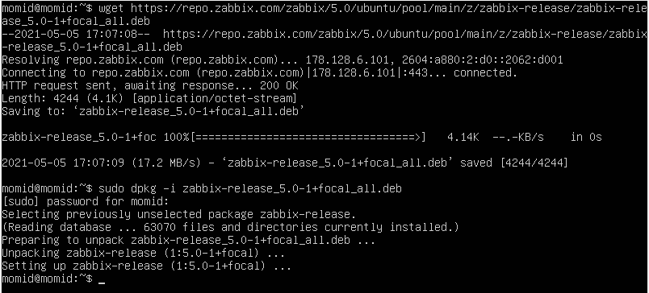

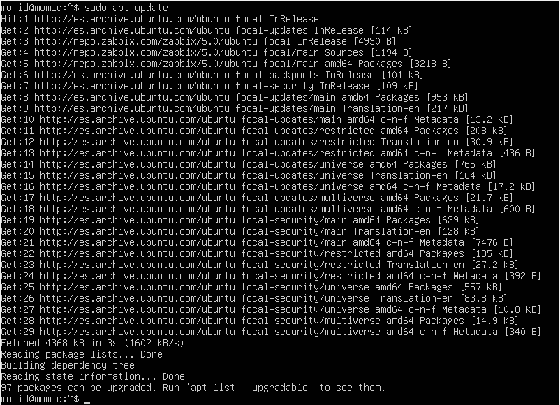

Tras haber actualizado los repositorios, instalamos el servidor de zabbix, el frontend y el agente, para lo que utilizamos el comando

<code>
apt install zabbix-server-mysql zabbix-frontend-php zabbix-apache-conf zabbix-agent
</code>

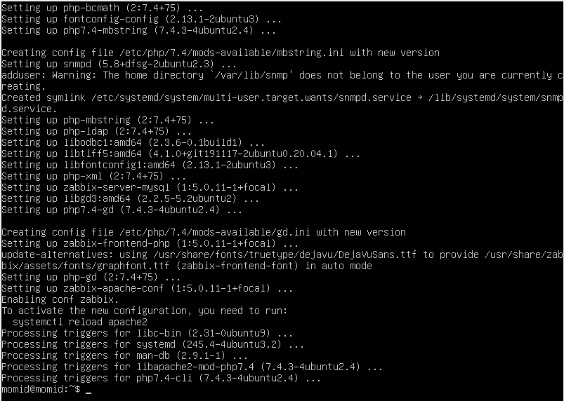

Ahora deberemos crear la base de datos incial. Tenemos que tener ya instalado el servidor de base de datos y debe estar activo y ejecutándose. Tras esto ejecutamos los siguientes comandos

<code>
mysql -uroot -p

password

mysql> create database zabbix character set utf8 collate utf8_bin;

mysql> create user zabbix@localhost identified by 'password';

mysql> grant all privileges on zabbix.* to zabbix@localhost;

mysql> quit;
</code>

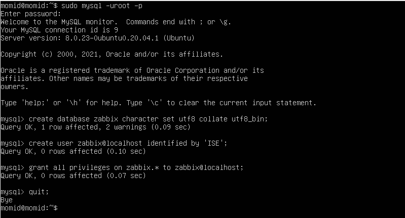

, donde he sustituido donde pone password por ISE, pues esta será mi contraseña. Tras esto en el host del servidor de zabbix importaremos el esquema inicial y los datos, es decir, en la base de datos creada en el paso anterior introduciremos unos datos iniciales. Para ello ejecutamos el siguiente comando, que tardará varios minutos en completarse

<code>
zcat /usr/share/doc/zabbix-server-mysql*/create.sql.gz | mysql -uzabbix -p zabbix
</code>

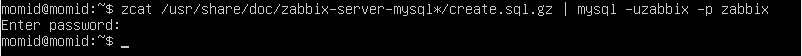

Tras ejecutar el comando nos pedirá que introduzcamos nuestra constraseña. En mi caso es ISE, pues en el paso anterior así lo indiqué. Es fundamental no hacer un Ctrl+c en lo que se ejecuta el comando anterior, pues si lo hacemos no se creara correctamente el esquema inicial de datos y luego nos dará problemas.

Ahora pasamos a configurar el servidor zabbix, para ello vamos al archivo <code>/etc/zabbix/zabbix_server.conf</code> y en la línea en la que este <code>DBDPassword</code>, la descomentamos y igualamos el parámetro a nuestra contraseña.

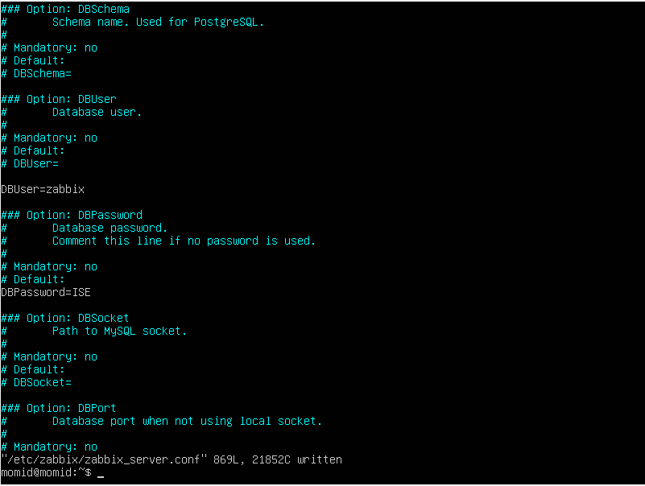

Tras esto nos metemos en el archivo <code>/etc/zabbix/apache.conf</code>, de forma que descomentemos las lineas encargadas de la fecha y la hora y las ponemos a *Europe/Madrid*

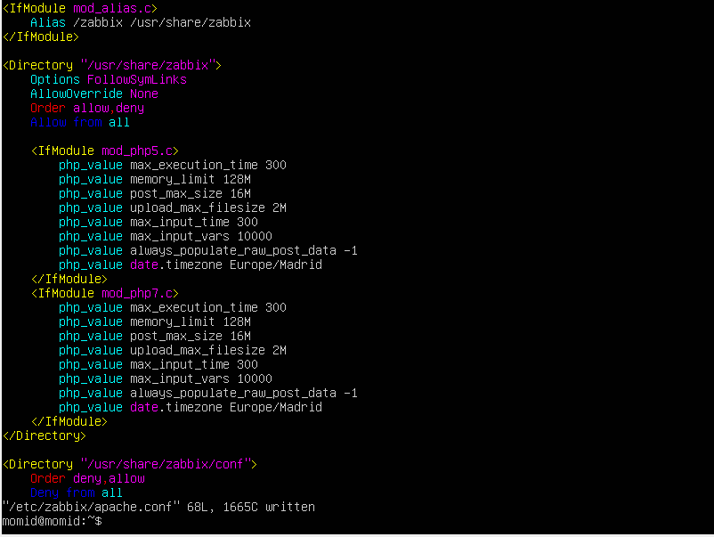

Una vez terminado de modificar los archivos de configuración de Apache y del server de zabbix tenemos que iniciar los servicios de servidor de zabbix, del agente de zabbix y de apache y activarlos para que se inicien automáticament al encender el sistema

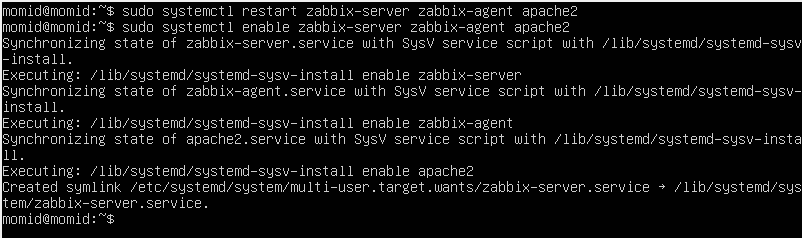

Tras esto en un navegador introducimos <code>http://ip_aloja_zabbix/zabbix</code> y nos lleva a la siguiente página

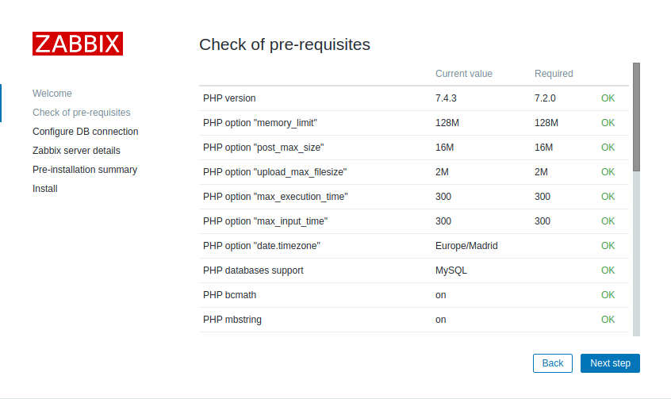

Tras esto le damos a next step y nos manda a

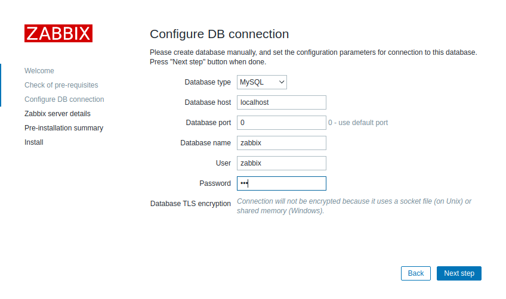

, en esta página en el apartado Password introducimos la que le hayamos indicado al archivo de configuración de Apache, en mi caso *ISE*, y le damos a next step.

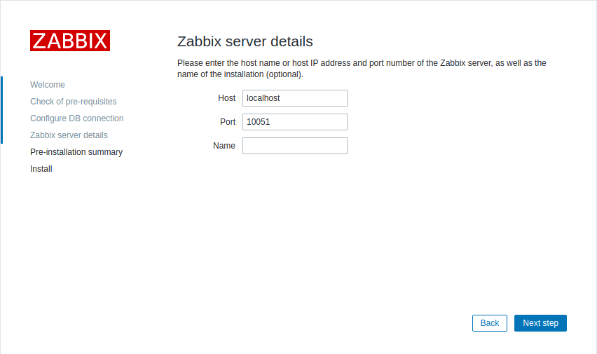

En esta pestaña no tocamos nada, sino que pasamos directamente a la siguiente

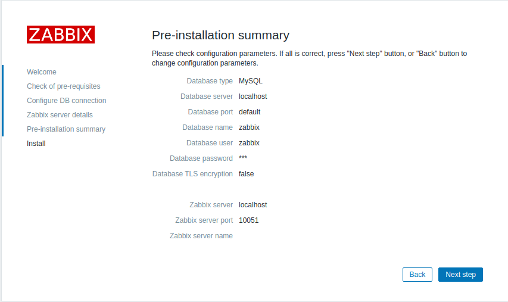

De nuevo pasamos directamente a la siguiente pestaña

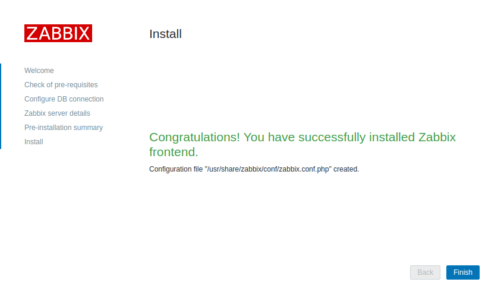

Y por último le damos a Finish que nos redirigirá a una página que nos pide unas credenciales.

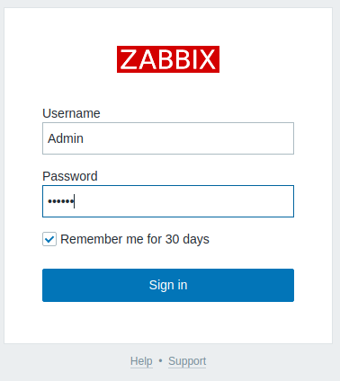

Las credenciales predeterminadas son 

<code>
Username: Admin
Password: zabbix
</code>

Tras darle a sing in nos mandará a la imagen siguiente, y comenzamos con la configuración.

### Configuración ###
Una vez seguidos los pasos para instalar zabbix en una máquina UbuntuServer hasta la configuración del front-end nos metemos por el navegador y encontraremos

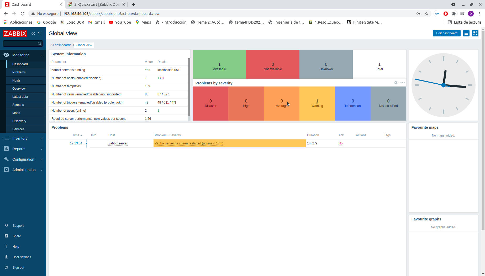

Vemos que se nos indica que Zabbix-Server está corriendo. Antes que nada lo que haremos será cambiar la contraseña del usuario, para evitar ataques por fuerza bruta o ataques por diccionario, aunque zabbix por defecto cada 5 intentos fallidos, impide el acceso durante 30 segundos. Para ello vamos a la pestaña *User settings* y alli le damos a *Change password* 

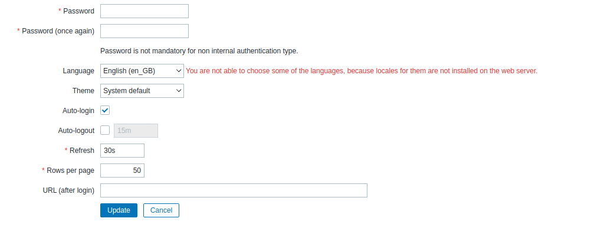

En mi caso he cambiado la contraseña a ISE. También podríamos crear un usuario nuevo, añadirlo al grupo de administradores de Zabbix y eliminar al que se crea por defecto (esto sería lo adecuado pero me di cuenta tarde).

Ahora creamos un nuevo host que será el correspondiente al zabbix-agent de CentOS. Para ello vamos a *Configuración $\rightarrow$ Hosts*, y nos saldrá

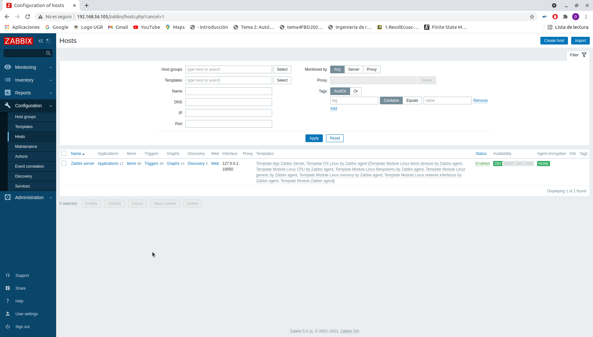

Le damos al icono *Create Host* de arriba a la derecha y introducimos las características del host que queremos añadir, quedándonos en nuestro caso algo como

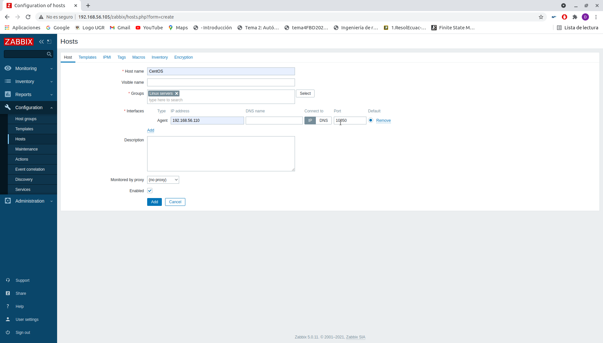

Vemos que sólo añadimos el nuevo host al grupo de *Linux Servers*, pues CentOS no lo podemos añadir a *Zabbix Servers*, ya que no tiene instalado nada más que el agente de zabbix. Tras esto nos aparecerá en *Availability* que ZBX estará en gris, tal que así

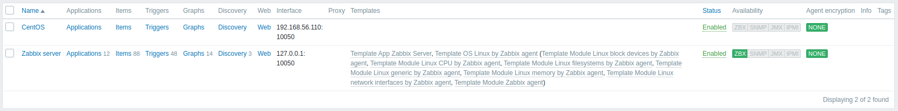

Tras esto vamos a añadirle *items* al nuevo host que hemos creado, esto lo que nos permitirá será la monitorización de los campos que nosotros eligamos. Para ello vamos a *Configuration $\rightarrow$ Hosts* y pulsamos en el apartado de Items de la máquina que hemos creado y tras estos en *Create item*. En este caso hemos creado un item para monitorizar la carga de la CPU de nuestra máquina CentOS, luego hemos introducido los siguientes parámetros (el parametro Type of information hay que ponerlo a Numeric (float), sino luego dará un error de incompatibilidad)

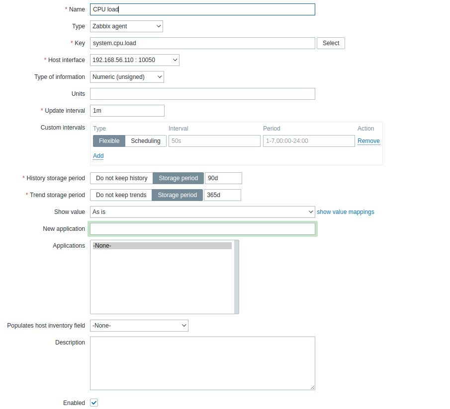

y tras esto de damos a *Add* y nos creará un item, y si hemos marcado el campo *Enabled* como es en nuestro caso se activará automáticamente el item. Sin embargo, si ejecutamos dicho item, nos sale

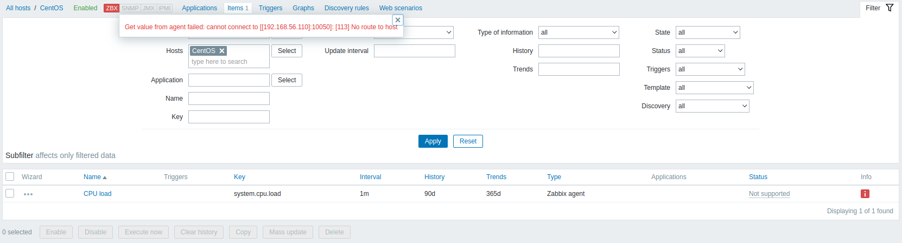

, *No Route To Host*, esto se debe a que como ya sabemos CentOS es muy exquisito con los puesto, luego tendremos que añadir los puertos que usa Zabbix al firewall, para ello hacemos

<code>
cat /etc/services | grep zabbix
</code>

esto nos mostrara que Zabbix utiliza dos puertos, el 10050 y el 10051, ambos tanto TCP como UPD, estos debemos añadirlos al firewall. Para ello hacemos

<code>
sudo firewall-cmd --permanent --add-port=10050/tcp

sudo firewall-cmd --permanent --add-port=10050/udp

sudo firewall-cmd --permanent --add-port=10051/tcp

sudo firewall-cmd --permanent --add-port=10051/udp

sudo firewall-cmd --reload
</code>

Con esto ya tenemos añadidos los puertos que usa zabbix al firewall. Ahora volvemos al item, ejecutamos el item y nos volverá a dar error.

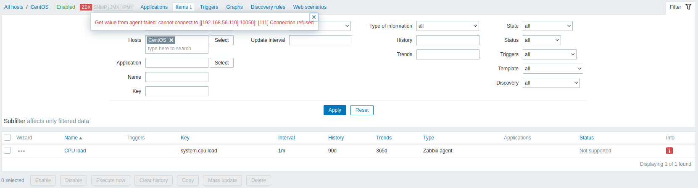

Vemos que ha dado otro error, esta vez conexión rechazada. Esto se debe a que en el archivo de configuración del agente de zabbix en CentOS, la dirección IP del Servidor es incorrecta. Nos vamos a <code>/etc/zabbix/zabbix_agentd.conf</code> y en dicho archivo ponemos

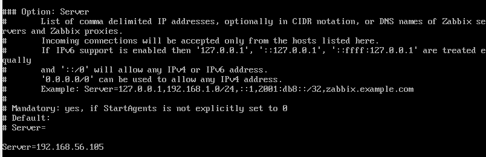

Y tras esto volvemos a ejecutar el item, que nos mostrará que efectivamente funciona

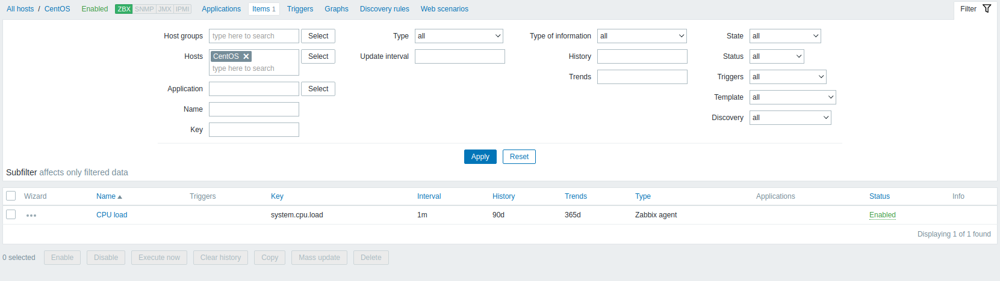

Vemos que ya es correcto. Podemos comprobarlo también mirando en *Monitoring $\rightarrow$ Latest data* y ahí podemos consultar los datos que va mandando CentOS.

Ahora configuraremos ambos host para que monitorizen tanto *httpd* como *ssh*. Para ello vamos a utilizar templates ya creados por Zabbix. Vamos a *Configuration $\rightarrow$ Hosts* clickamos dos veces sobre Zabbix Server, y nos lleva la configuración del host

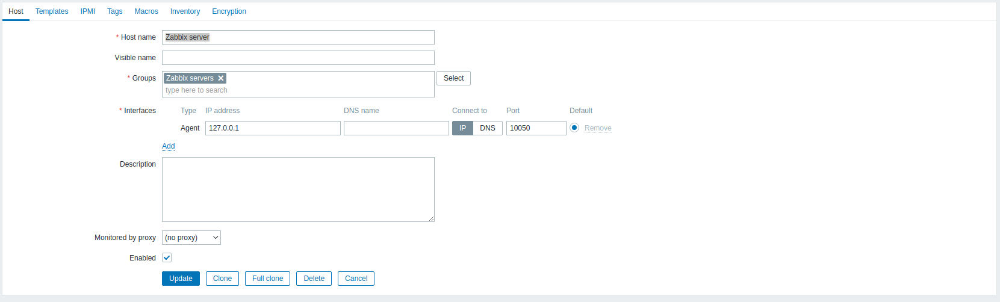

Desde aquí pinchamos en templates y en el apartado *Link new templates* escribimos SSH y nos aparecerá un template, que es *Template App SSH Service*, el cual nos monitorizará SSH. Hacemos lo mismo para HTTP y linkeamos *Template App HTTP Service*, que nos monitorizará a HTTP, y le damos a Update.

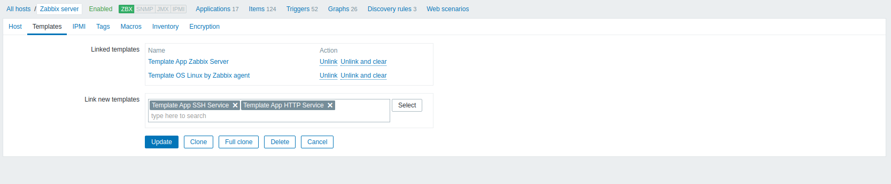

Hacemos análogo para la máquina de CentOS. Con esto vemos que nos empezará a monitorizar ambos servicios, pero nos va a dar error al monitorizar el servicio SSH, pues el puerto que aceptan ambas máquinas por SSH es el 22022 y por defecto zabbix está consultando el puerto 22. Para cambiar eso vamos al item SSH service is running y le damos doble click para entrar en la configuración del item.

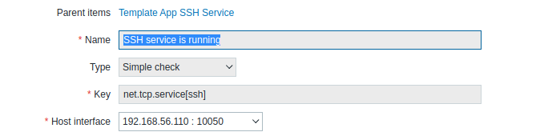

Tenemos que cambiar en el apartado de key donde pone ssh por el puerto al que se quiere consultar, que es el 22022. Para ello pulsamos por donde pone *Parent items Template App SSH Service*, y nos lleva a una ventana análoga a esta que si nos deja modificar lo anterior.

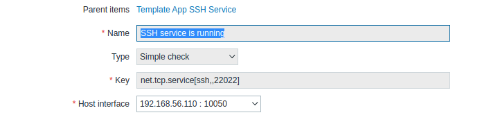

De tal forma que lo ponemos correctamente y le damos a update. Si ahora nos vamos al apartado *Monitoring $\rightarrow$ Problems* veremos que el problema para la máquina CentOS que es sobre la cual hemos hecho el cambio anterior el problema ha desaparecido y funciona correctamente. 

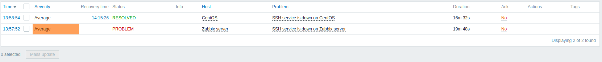

Esta modificación se almacena para el template, luego para todo host que tenga dicho template se aplicarán los cambios. Con esto tendremos lo básico, es decir, ya se ha configurado los parámetros para que se monitorice los servicios SSH y HTTP tanto en UbuntuServer, como en CentOS. Ahora probaremos que efectivamente fuciona la monitorización de HTTP y SSH. Para ello primero paro ambos servicios en la máquina CentOS, y veamos que efectivamente se han parado.

Vemos que efectivamente ha detectado la caída de ambos servicios. Los vuelvo a activar, y repito el proceso para UbuntuServer. Obviamente HTTP no lo puedo tirar, pues entonces no funcionaría Apache2 y no me dejaría acceder al servidor de Apache en el navegador.

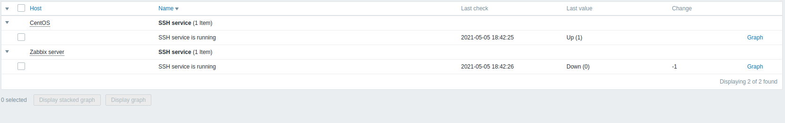

Nos muestra que ha detectado la caída de SSH en UbuntuServer. Por otro lado si bien no podemos tirar HTTP en UbuntuServer pues sería tirar el propio Zabbix-Server que está alojado en UbuntuServer si podemos observar que se ha detectado la reactivación de HTTP en CentOS. Ahora probamos que detecte la reactivación de SSH en UbuntuServer.

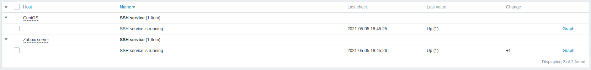

Esto se puede ampliar, por ejemplo, al utilizar los templates en el host Zabbix Server, hemos visto que aparte de los dos que hemos añadido (SSH y HTTP), tiene por defecto algunos más, como por ejemplo *Template OS Linux by Zabbix agent*, el cual sirve para monitorizar componentes de Linux, como la CPU, memoria, disco, red e inventario. Como nuestra máquina CentOS es una distro de Linux podemos aplicarle este template también a esa máquina, para que nos recoja más información.

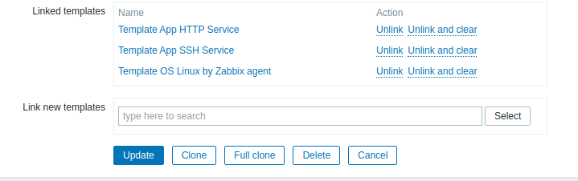

De hecho si nos vamos de nuevo al apartado *Monitoring $\rightarrow$ Latest Data*, y filtrando por máquina podemos consultar los datos que ha recogido Zabbix para cada uno de nuestros hosts (seleccionamos todos los datos que se están recogiendo y le damos a Display Graph).

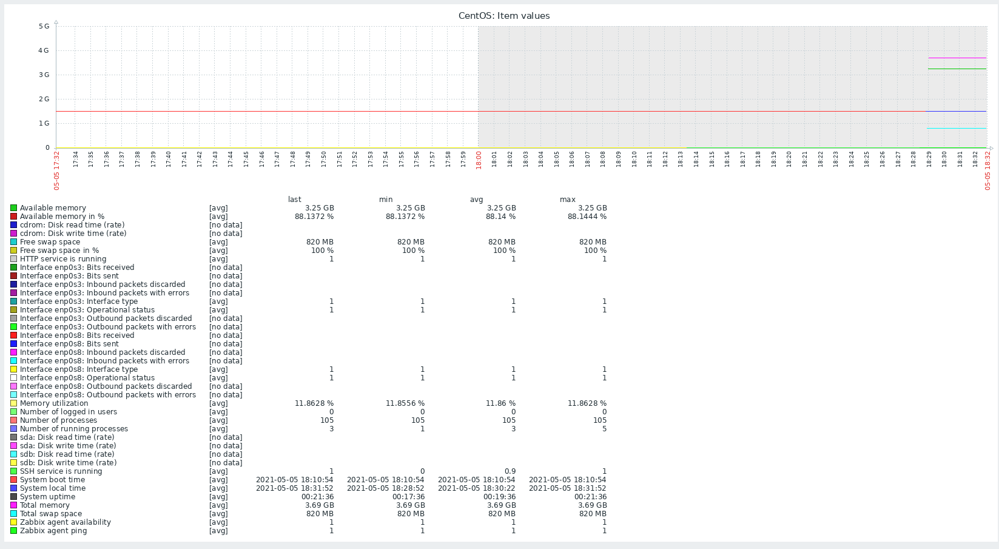

Vemos que con el template añadido nos monitoriza a parte de los dos servicios varios parámetros de memoria, varios parámetros de nuestros discos duros, de la CPU, etc. Y de hecho podemos eliminar el item que habíamos creado inicialmente, pues está incluido en el template que acabamos de añadir.

Con esto concluye el ejercicio. El host Zabbix server nos monitoriza tanto SSH como HTTP en la maquina UbuntuServer, así como otros muchos parámetros como CPU, memoria, inventario, etc. Y análogamente hemos configurado un host CentOS que monitorice a la máquina de CentOS_LVM, así como otros parámetros como CPU, inventario, disco, memoria, etc.  

## Ejercicio 2 ##
### Preámbulo ###
Lo primero que vamos a hacer es crear un script en python para automatizar el comprobar que el RAID está funcionando correctamente. Dicho script lo que va a hacer es comprobar que en el archivo <code>/proc/mdstat</code> los RAID tienen todos los discos up, es decir, que no haya ninguna '_'.

El script en cuestión contendrá,

<code>
import re

f=open('/proc/mdstat')

for line in f:

    b=re.findall('\[[U]*[_]+[U]*\],line)
    if(b!=[])
        print("ERROR EN RAID")

print("FIN SCRIPT")
</code>

Lo que hace este script es comprobar en cada linea del fichero <code>/proc/mdstat</code> si encuentra alguna '_' independientemente de donde esté situada, pues esto indica que alguno de los discos duros del RAID se ha caído. Si encuentra alguna barra baja nos indicará por pantalla que 'ERROR EN RAID'. 

Tras esto procederemos a crear un servicio y un timer asociados a nuestro script. Para ello vamos al directorio <code>/etc/systemd/system</code>, el cual contiene lso ficheros y temporizadores de los servicios del sistema. Debemos ser cuidadosos de llamarlos <code>servicio_raid.service</code> y <code>servicio_raid.timer</code>, es decir, que el timer y el servicio tengan el mismo nombre, pues el timer llamará al servicio que tenga su mismo nombre con la frecuencia indicada. El timer contendrá

<code>
[Unit]

Description=Monitor RAID Service

[Timer]

OnCalendar=minutely

[Install]

WantedBy=timers.target
</code>

, donde en la descripción hemos indicado que es un servicio de RAID, en el timer que es cada minuto y en el install hemos indicado que se trata de un timer. Por otro lado el archivo .service contendrá

<code>
[Unit]

Description=Monitor RAID Service

[Service]

Type=simple

ExecStart=/usr/bin/python3 /home/usuario/script.py
</code>

, donde en la descripción indicamos que es un servicio de RAID, y en el servicio indicamos que se ejecute python3 que está en el directorio indicado y el script de monitorización que hemos creado.

Tras esto, debemos entender en cuenta que se trata de un servicio, luego con <code>systemctl</code> podemos iniciarlo (<code>sudo systemctl start nombre_servicio.service nombre_servicio.timer</code>), activarlo para que se incie cuando el sistema arranque (<code>sudo systemctl enable nombre_servicio.service nombre_servicio.timer</code>) y comprobar que ambos estén activos (<code>sudo systemctl status nombre_servicio.service nombre_servicio.timer</code>).

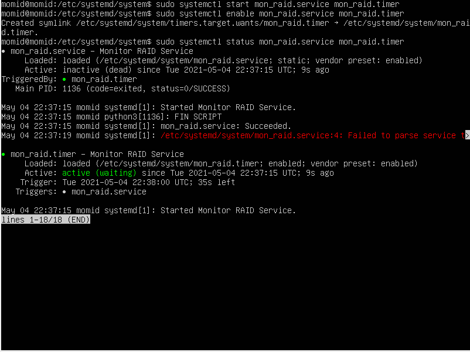

Podemos observar que el .timer si que está activo pero el .service está inactivo, pues sólo se activa una vez cada minuto cuando el .timer lo invoca. De hecho esto se observa en la imagen anterior, pues en el apartado de Triggers del .timer se indica el servicio que invoca y en el apartado TriggeredBy del .service se ve quien le invoca. 

Para comprobar que el servicio funciona correctamente podemos hacer <code>sudo journalctl -u nombre_servicio --since="yesterday"</code>, donde se nos mostrarán los mensajes del servicio que sigue a -u desde la fecha indicada en since. Esto se podría mejorar para que nos mandase periódicamente una notificación al correo.

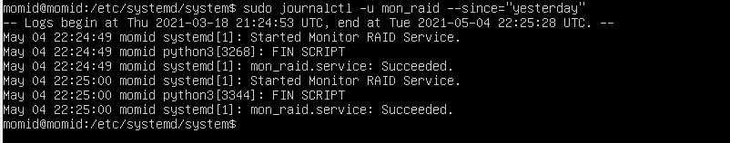

Se puede ver que nos manda mensajes de 'FIN SCRIPT', indicando que el RAID funcionaba correctamente cuando el servicio se ha activado. Ahora podemos probar que si uno de los discos de un RAID se cae sigue funcionando correctamente, para ello quitamos uno de los discos del RAID (debe ser conectable en caliente), y volvemos consultar <code>journalctl</code>, y nos quedará algo así

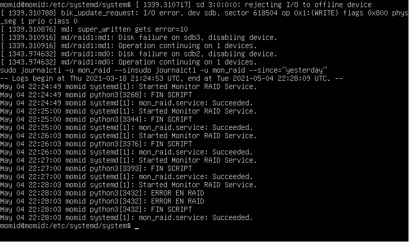

Se ve que en los mensajes del servicio aparece que hay error en RAID, pues falta uno de los discos duros.

### Ansible ###
Una vez creado el script, el servicio y el timer para monitorizar el funcionamiento del RAID procedemos expandir esto con ansible a otras máquinas. Para ello en caso de no tenerlo previamente instalado, instalamos ansible con el comando <code>sudo apt install ansible</code>. Podemos comprobar que está instalado con <code>ansible --version</code> y nos mostrará algo como.

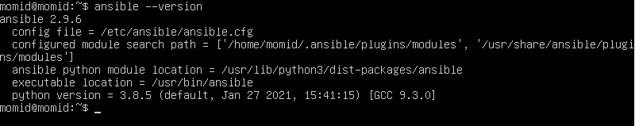

Tras esto debemos indicar a ansible que servidores queremos monitorizar (automatizar en nuestro caso), nos vamos al fichero <code>/etc/ansible/hosts</code>, y en este escribimos las IP de las máquinas a monitorizar/automatizar. El propio fichero nos indica como rellenarlo.

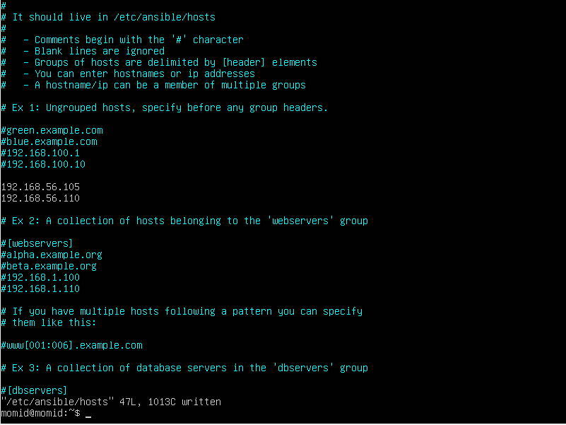

En este caso se han monitorizado/automatizado dos máquinas, la que ejecuta ansible y una máquina CentOS que está conectada con la máquina Ubuntu que ejecuta ansible por ssh y tiene compartidas con ella las claves público-privadas, de forma que la conexión por ssh es automática.

Para ejecutar un ping a las máquinas indicadas en el fichero de hosts hacemos <code>ansible all -m ping -u momid</code>, pero nos deberá de dar error. 

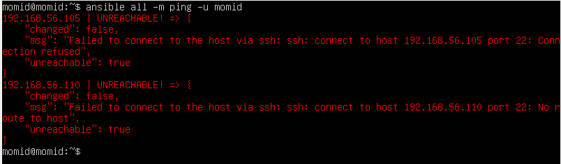

Esto se debe en primer lugar a que la máquina Ubuntu no se puede conectar adecuadamente a sí misma, pues si bien con la máquina de CentOS si tiene compartida las claves público-privadas, consigo mismo no. Luego compartimos las claves público-privadas de la máquina que ejecuta ansible consigo misma con <code>ssh-copy-id usuario@ip_maquina -p puerto</code> (si tenemos configurado ssh para que no acepte contraseñas, debemos autorizar la autenticación por constraseñas, pues sino el comando anterior no funcionará). 

Tras esto si volvemos a ejecutar el ping si no tenemos configurado ssh para que utilize el puerto 22 nos volverá a dar error, pues por defecto ansible usa el puerto 22 para las peticiones de ssh. Para solucionar esto nos vamos al archivo de configuración <code>/etc/ansible/ansible.cfg</code> y en la línea donde pone remote_port, descomentamos remote_port y indicamos el puerto en el que tengamos ssh escuchando, en mi caso el 22022.

Tras esto volvemos a ejecutar el ping y ya debería funcionar correctamente.

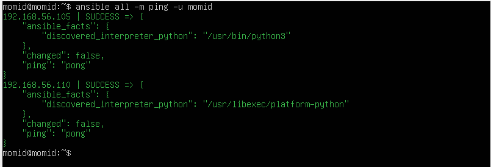

Esto nos indica que ansible ya tiene conexión a las máquinas indicadas en el fichero de hosts. Ahora tenemos que configurar ansible para que automatice el script que hemos creado anteriormente. Si intenatamos ejecutar el script con <code>ansible all -a "python3 /home/momid/script.py" -u momid</code>, nos funcionará correctamente en UbuntuServer que es la máquina que ejecuta ansible y que tiene el script, pero nos dará error en CentOS, pues no se tiene el script en dicha máquina.

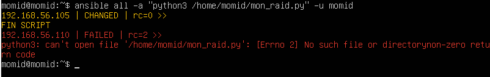

Vemos que en la máquina CentOS nos ha dado error de que no encuentra el script a ejecutar. Esto lo solucionamos mandando el script por ssh a las máquinas que no lo tengan son <code>scp -P 22022 script.py momid@192.168.56.110:/home/momid/script.py</code>, donde lo que se indica es -P puerto, el fichero a enviar, el usuario y la IP que usamos en SSH y el directorio donde guardar el fichero. Tras esto debería funcionar 

Lo explicado en este archivo es muy limitado, pues por ejemplo el script de python se debe encontrar en el mismo directorio, el usuario debe ser el mismo, etc. Esto es ampliable utilizando los playbooks de ansible.

## Referencias ##
1. [Documentación Zabbix 5.0](https://www.zabbix.com/documentation/5.0/manual/installation/install#installing_frontend)
2. [Error 113 no route to host](https://bobcares.com/blog/zabbix-113-no-route-to-host/#:~:text=It%20alerts%20server%20administrators%20about%20server%20failures.&text=However%2C%20often%20while%20adding%20servers,some%20bad%20routing%2Fnetwork%20configuration.)
3. [Error 111 conecction refused](https://bobcares.com/blog/zabbix-111-connection-refused/#:~:text=Receiving%20an%20error%20Zabbix%20111,of%20our%20Server%20Management%20Services.)

4. [Template OS Linux by Zabbix agent](https://share.zabbix.com/operating-systems/linux/template-os-linux-by-zabbix-agent-active)

## Aclaraciones ##
1. En el ejercicio 1 no se ha creado un host para UbuntuServer, pues el host Zabbix server tiene como IP <code>127.0.0.1</code>, que es el localhost, y como el zabbix-server está alojado en nuestra máquina UbuntuServer, esta será la que monitorice.
2. En el ejericio 1 no se ha creado un nuevo usuario que tenga permisos de administrador, y eliminado el que dan por defecto, pues me di cuenta al terminar de configurar todo el servidor. De todas formas si se ha modificado la contraseña por defecto.