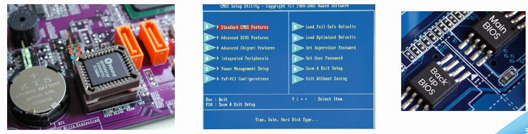

# Apuntes Ingeniería de Servidores #
### Daniel Monjas Miguélez ###
## Tema 1 ##
### ¿Qué es un servidor? ###
Se define como sistema informático (S.I.) al conjunto de elementos **hardware, software y peopleware** interrelacionados entre sí que permiten obtener, procesar y almacenar información.
* **Hardware**: conjunto de componentes físicos que forman el sistema informático (procesadores, memoria, almacenamiento, cables, etc).
* **Software**: conjunto de componentes lógicos que formanel sistema informático (sistema operativo y aplicaciones).
* **Peopleware**: conjunto de recursos humanos. En nuestro caso, el personal técnico que instala, configura y mantiene el sistema (administradores, analistas, programadores, operarios, etc) y los usuarios que lo utilizan.

### Clasificación de Sistemas Informáticos ###
Los Sistemas informáticas pueden clasificarse según numerosos criterios. Por supuesto, las clasificaciones no son estancas y es común encontrar sistemas híbridos que no encajen en una única categoría.

Por ejemplo, podríamos clasificarlos según el paralelismo de su arquitectura de procesamiento (taxonomía de Flynn, para más info leer el libro de Mancia):
* SISD: Single Instruction Single Data
* SIMD: Single Instruction Multiple Data
* MISD: Multiple Instruction Single Data
* MIMD: Multiple Instruction Multiple Data

 

A parte de este criterio de clasificación se pueden utilizar otros, por ejemplo

#### Clasificación de S.I. según su uso ####
Según su uso, un sistema informático pueden considerares:
* De uso general, como los computadores personales (PC) que son utilizados por un usuario para ejecutar muy diversas aplicaciones.
    * PC de sobremesa (desktop)
    * PC portátil (laptop)

* De uso específico:
    * Sistemas empotrados (embedded systems)
    * Servidores (servers)

Dentro de esta clasificación prestaremos especial atención a los sistemas informáticos de uso específico

### Sistemas empotrados (embedded Systems) ###
Son sistemas informáticos acoplados a otro dispositivo o aparato, diseñados para realizar una o algunas funciones dedicadas, frecuentemente con fuertes restricciones de tamaño, tiempo de respuesta (sistemas de tiempo real), consumo y coste.

Suelen estar formados por un microprocesador, memoria y una amplia gama de interfaces de comunicación (microcontrolador).

Entre los ejemplos que podemos encontrar de sistemas empotrados tenemos, taxímetros, el sistema de control de una fotocopiador, una cámara de vigilancia, un teléfono, la electrónica que controla un automóvil, etc.

### Servidores ###
Son sistemas informáticos que, formando parte de una red, proporcionan servicios a otros sistemas informáticos denominados clientes.

Un servidor no es necesariamente una máquina de última generación de grandes proporciones, puede ser desde un computador de gama baja (coste bajo) hasta un conjunto de clusters de ordenadores en un Centro de Procesamiento de Datos (CPD).

Dentro de los servidores encontramos una gran variedad de tipos en función de la tarea que desempeñan:

* Servidor web: almacena documentos HTML, imágenes, archivos de texto, etc. y distribuye este contenido a clientes que lo soliciten en la red.

* Sevidor de archivos: permite el acceso remoto a archivos almacenados en él o directamente accesibles por este.

* Servidor de base de datos: provee servicios de base de datos a otros programas u otras computadoras.

* Servidor de comercio-e: cumple o procesa transacciones comerciales (comercio electrónico). Valida al cliente y genera un pedido al servidor de bases de datos.

* Servidor DHCP: asigna dinámicamente una dirección IP y otros parámetros de configuración de red a cada disporitivo que entra en una red.

* Servidor DNS: devuelve la dirección IP asociada a un nombre de dominio.

* Servidor de impresión: controla una o más impresoras y acepta trabajos de impresión de otros clientes de la red.

### Clasificación de S.I. según la arquitectura del servicio
Según la arquitectura del servicio, es decir, cómo se establece la interacción entre el servidor y sus clientes, podemos distinguir entre:
* Sistema aislado.
* Arquitectura cliente/servidor.
* Arquitectura cliente-cola-cliente.

Veamos las posibles arquitecturas de servicio con más detalle:
* **Sistema aislado**. Se trata de un sistema computacional que no interactúa con otros sistema. Es una arquitectura monolítica en la que no existe distribución de información.

* **Arquitectura cliente/servidor**. Es un modelo de aplicación distribuida en el que las tareas se reparten entre los proveedores de recursos o servicios, llamados servidores, y los demandantes, llamados clientes. Suelen tener dos tipos de nodos/niveles en la red:
    * Clientes (remitentes de solicitudes).
    * Servidores (receptores de solicitudes).

* **Arquitectura cliente/servidor de varios niveles**. En este tipo de arquitectura el servidor se sub-divide en varios niveles de (micro-)servidores más sencillos con funcionalidades diferentes en cada nivel. Esto mejora la distribuición de carga entre los diversos servidores, y es más escalable. 
    Por otro lado pone más carga en la red y es más difícil d eprogramas y administrar. Un ejemplo de esta arquitectura para 3 niveles sería como sigue:

    * Nivel 1: Clientes
    * Nivel 2: Servidores de comercio-e que interactuan con los clientes
    * Nivel 3: Servidores de bases de datos que almacenan, buscan y gestionan los datos para los servidores de comercio-e.

* **Arquitectura cliente-cola-cliente**. Habilita a todos los clientes para desempeñar tareas semejantes interactuando cooperativamente para realizar una actividad distribuida, mientras que el servidor actúa como una cola que va capturando las peticiones de los clientes y sincronizando el funcionamiento del sistema. Encontramos las siguientes aplicaciones que utilizan este tipo de arquitectura:
    * Intercambio y búsqueda de ficheros (BitTorrent, eDonkey2000, eMule).
    * Sistemas de telefonía por Internet (Skype).

Observación: la arquitectura P2P está basada en este concepto.

### Fundamentos de Ingeniería de Servidores ###
En el diseño, configuración y evaluación de un Servidor se tienen que tener en cuenta los siguientes aspectos:
* Recursos físicos, lógicos y humanos.

| Placa base                        | Sistema Operativo |
| --------------------------------- | -----------------:|
| Memoria                           | Aplicaciones      |
| Microporcesador                   | Conexiones de red |
| Funete de alimentación            | Cableado          |
| Periféricos (E/S, almacenamiento) | Refrigeraión      |

* Requisitos funcionales (los más importantes).
 
| Prestaciones  | Disponibilidad    | Fiabilidad    |
| ------------- | -----------------:| -------------:|
| Seguridad     | Extensibilidad    | Escalabilidad |
| Mantenimiento | Coste             |               |

### Prestaciones (*Performance*) ###
Se define como la medida o cuantificación de la velocidad con que se realiza una determinada carga o cantidad de trabajo (*workload/load*).

Entre las medidas fundamentales de prestaciones que un servidor debe cumplir se encuentran:
* Tiempo de respuesta (*response time*) o latencia (*latency*). Se define como el tiempo total desde que se solicita una tarea al servidor o a un componente del mismo y la finalización de la misma. Por ejemplo:
  * Tiempo de ejecución de un porgrama
  * Tiempo de acceso a un disco.

* Productividad (*throughput*) o ancho de banda (*bandwidth*). Cantidad de trabajo realizado por el servidor o por un componente del mismo por unidad de tiempo. Por ejemplo:
  * Programas ejecutados por hora.
  * Páginas servidas por hora por un servidor web.
  * Correos por segundo procesador pon un servidor de correo.
  * Peticiones por minuto procesadas por un servidor de comercio electrónico.

Las formas típicas de las productividad y el tiempo de respuesta de un servidor frente a la carga son:

La primera gráfica nos dice que si el número de clientes es bajo la productividad también lo será lo cual es obvio, pues no habrá que peticiones que servir y la capacidad del servidor se desaprovecha. Por otro lado, nos dice que si el número de clientes se hace muy grande a partir de un cierto punto la productividad del servidor se estanca, nunca llegando al máximo de la productividad, lo cual es esperable, pues por muchas peticiones que lleguen la capacidad del servidor seguirá siendo la misma, teniéndo que reservar parte de esa capacidad para otras tareas.

La segunda gráfica nos dice que el tiempo de respuesta tiende a infinito conforme los clientes tiendan a infinito, lo cual era esperable, pues una vez el servidor esté utilizando su máxima capacidad los clientes pasarán a entrar en cola a la espera de que el servidor responda la solicitud, siendo mayor la espera cuanto más clientes hayan.

**Notación**: $X_0$ denota la productividad, y $R_0$ denota el tiempo de respuesta.

### ¿Qué afecta a las prestaciones?¿Cómo podemos mejorarlas? ###
Las prestacoines se ven afectadas por:
* Componentes hardware del sistema.
  * Características y configuración (cuello de botella)
* Sistema operativo.
  * Tipo de sistema operativo
  * Políticas de planificación de procesos
  * Configuración de memoria virtual, etc.
* Aplicaciones:
  * Hot spots.
  * Acceso a E/S, *swapping*, etc.
  * Fallos de caché, de página, etc.

La pretaciones se pueden mejorar por medio de:
* Actualización de componentes:
  * Reemplazar por dispositivos maś rápidos.
  * Añadir nuevos componentes, lo que nos permitirá realizar distribución de carga (*load balancing*), dando mayor carga a aquellos componentes más rápidos.

* Ajuste o sincronización:
  * Configuración de componentes hardware.
  * Parámetros del sistema operativo (en prácticas se vió que tocando ciertos parámetros del kernel se podían obtener mejoras en el rendimiento).
  * Optimización de programas

Una de nuestras principales misiones será analizar nuestro servidor para determinar los factores que afectan a su rendimiento y encontrar posibles soluciones para su mejora.

### Disponibilidad (*Availability*) ###
Un servidor se dice que está disponible si se encuentra en estado operativo, es decir, respondiendo peticiones de los clientes. Se definde por **tiempo de inactividad (*Downtime*)**, a la cantidad de tiempo que el sistema no está disponible, y este tiempo de inactividad se divide en:
* Tiempo de inactividad planificado. Por ejemplo, actualizaciones de software o hardware que requieran re-arranques del sistema.
* Tiempo de inactividad no planificado. Surgen de algún evento físico tales como fallos en el hardware, anomalías ambientales o fallos de software. Una alta disponibilidad implica que el sistema sea tolerante a fallos.

### ¿Cómo mejorar las disponibilidad de un servidor? ###
Para mejorar la disponibilidad de un servidor se puede:
* Utilizar sistemas operativos modulares que permitan actualizaciones sin re-iniciar el sistema.
* Inserción de componentes en caliente (*hot-pluggin*). Esto nos permite enchufar o desenchufar componentes en caliente, es decir sin apagar el sistema.
* Reemplazo en caliente de componentes (*hot-swapping*). Esto en cambio permite enchufar o sistituir componentes sin alterar la capacidad del sistema.
* Sistemas redundantes de discos (*RAID 1*). Un sistema RAID 1, es aquel que dispone de al menos dos discos duros, y toda la información de uno de ellos se ve replicada en los restantes, para que en caso de rotura de disco la información no se pierda.
* Sistemas redundantes de alimentación. Estos sistemas disponen de varias fuentes de alimentación, para en caso de fallo de una de ellas no se apague el sistema, sino que sigue funcionando con el suministro de energía de las restantes.
* Sistemas completos redundantes con distribución de carga (*load balancing*).

### Fiabilidad (*Reliability) ###
Se dice que un sistema es fiable cuando desarrolla su actividad sin errores. Se define como *Mean Time To Failure* (MTTF), como el tiempo medio que tiene un sistema (disco, memoria, etc.) hasta que ocurre un error.

Para mejorar la fiabilidad de un sistema de pueden utilizar sumas de comprobación (*checksums*, bits de paridad) para la detección y/o correccion de erorres (memorias ECC, *Error Correcting Code*), comprobar la recepción de paquetes de red y su correspondiente retransmisión, etc.

### Seguridad ###
Un servidor debe ser seguro ante:
* La incursión de individuos no autorizados (confidencialidad).
* La corrupción o alteración no autorizada de datos (integridad).
* Las interferencias (ataques) que impidan el acceso a los recursos.

Para mejorar la seguridad se puede utilizar:
* Autenticación segura de usuarios.
* Encriptación de datos.
* Antivirus.
* Parches de seguridad actualizados.
* Cortafuegos (*firewalls*).

### Extensibilidad-expansibilidad ###
Hace referencia a la facilidad que ofrece un sistema para aumentar sus características o recursos. Para mejorar la extensibilidad se puede:
* Disponer de bahías o conectores libres para poder añadir más almacenamiento, memoria, etc.
* Usar sistemas operativos modulares de código abierto, para así poder extender la capacidad del SO.
* Usar interfaces de E/S estándar, para facilitar la incorporación de nuevos tipos de dispositivos al sistema.
* Cualquier solución que facilite que el sistema sea escalable.

### Escalabilidad ###
Hace referencia a la facilidad que ofrece el sistema para poder aumentar de forma significativa sus características o recursos para enfrentarnos a un aumento significativo de la carga. Para mejorar la escalabilidad se puede utilizar:
* *Cloud computing* junto con virtualización
* Servidores modulares/clusters.
* Arquitecturas distribuidas/arquitecturas por capas.
* *Storage Area Networks* (SAN)
* Programación paralela (software escalable).

Todos los sistemas escalables son extensibles pero no a la inversa, es decir, todo sistema que puede mejorar su características de forma significativa se puede extender, pero no todo sistema que pueda aumentar sus caracterísitcas lo puede hacer de forma significativa.

### Mantenimiento (*Maintenance, support*) ###
Hace referencia a todas las acciones que tiene como objetivo prolongar el funcionamiento correcto del sistema. Es importante que el servidor sea fácil de mantener. Para ello, puede ser conveniente usar:
* Sistemas operativos con actualizaciones automáticas (parches de seguridad, actualización de drivers, etc.)
* *Cloud computing*: el proveedor se encarga del chequeo periódico de componentes y su actualización.
* Automatización de copias de seguridad (respaldo o backup).
* Automaticación de tareas de configuración y administración (Ansible, Chef, Puppet.)

### Coste ###
Tenemos que adaptarnos al presupuesto. No solo se ha de tener en cuenta el costo del hardware y el software sino también el coste de mantenimiento, personal (administrador, técnicos, apoyo...), proveedores de red, alquiler del local donde se ubica el servidor, consumo eléctrico tanto del servidor como de la refrigeración.

Para contribuir a abaratar el coste se puede utilizar:
* *Cloud Computing*.
* Usar software de código abierto.
* Reducir coste de electricidad (eficiencia energética):
  * Ajuste automático del consumo de potencia de los componentes electrónicos según la carga.
  * Free cooling, es decir, utilizar las bajas temperaturas del exterior para refrigerar el servidor de forma gratuita.

### Introducción a la comparación de características entre servidores ###

El computador de mejores prestaciones, para un determinado conjunto de programas, será aquel que ejecuta dicho conjunto de programas en un tiempo más corto. Cuando se comparan las prestaciones, en lugar de dar los tiempos de ejecución obtenidos se suele indicar:
* ¿Cuántas veces es más rápido un computador que otro?
* ¿Qué tanto por ciento de mejora aporta el equipo más rápido con respecto al más lento?

### Tiempos de ejecución mayores/menores ###
Veamos un ejemplo para ilustrarlo mejor. Sea $t_A$ el tiempo de ejecución de un programa en la máquina A, y análogo para $t_B$. Si $t_A=10s$, y $t_B=5s$, se tiene que,
* $t_A/t_B=2$, luego $t_A$ es un 100% mayor que $t_B$, o lo que es lo mismo, $t_A$ es el doble que $t_B$.
* $t_B/t_A=0.5$, luego $t_B$ es un $50%$ menor que $t_B$, o lo que es lo mismo, $t_B$ es la mitad que $t_A$.

El "cambio relativo de $t_A$ con respecto a $t_B$, $\Delta_{A,B}(\%)$, viene dado por:

$t_A=t_B+\frac{\Delta_{A,B}(\%)}{100}\times t_B$

, donde $\Delta t_{A,B}(\%)=\frac{t_A-t_B}{t_B}\times 100=\left(\frac{t_A}{t_B}-1\right)\times 100$. Aplicando esto al ejemplo anterior se tiene que:
* El cambio relativo de $t_A$ respecto a $t_B$ es 100%.
* El cambio relativo de $t_B$ respecto a $t_A$ es -50%.

### ¿Qué máquina es más rápida? Speedup ###
La "velocidad de una máquina A para ejecutar un programa será inversamente proporcional a $t_A$. Es decir, $v_A=D/t_A$, donde D será el cómputo realizado por la máquina.

Se define la ganancia en velocidad de la máquina $A$ respecto a la máquina $B$ como:

$S_B(A)=\frac{v_A}{v_B}=\frac{t_B}{t_A}$

El cambio relativo de $v_A$ con respecto a $v_B$ viene dado por

$\Delta v_{A,B}(\%)=\frac{v_A-v_B}{v_B}\times 100=\left(\frac{v_A}{v_B}-1\right)=(S_B(A)-1)\times 100$

### Coste y relación prestaciones/coste###
Se define la relación prestaciones coste como:

$\frac{Prestciones}{Coste}$

Por otro lado para comparar la relación prestaciones coste de dos másquinas se hace:

$\frac{Prestaciones_A/Coste_A}{Prestaciones_B/Coste_B}$

### Introducción a la mejora del tiempo de respuesta de un servidor (Ley de Amdahl). ###

Una de las formas más habituales de mejorar el tiempo de respuesta de un servidor consiste en reemplazar un componente por otro más rápido.

El caso más sencillo para evaluar la mejora conseguida consiste en suponer que en el servidor sólo se ejecuta un único proceso monohebra. En ese caso supongamos que:
* El servidor tarda un tiempo $T_{original}\equiv T_0$ en ejecutar dicho proceso.
* Mejoramos el sistema reemplazando uno de sus componentes por otro k veces "más rápido" (suponiendo $k>1$), es decir $(k-1)\times 100$ "más rápido".
* Este componente se utilizaba una fracción de tiempo $f$ del tiempo original.

Para calcular la ganancia se utilizará la ley de Amdahl cuya expresión es:

$S=\frac{1}{1-f+f/k}=\frac{t_0}{t_0(1-f)+f\cdot t0/k}$

Entre los casos particulares de la ley de Amdahl encontramos:
* Si $f=0\Rightarrow S=1$, es decir, no hay ninguna mejora
* Si $f=1\Rightarrow S=k$, es decir, la ganancia es tan alta como la mejora que introduce la nueva componente.

Otro caso que combiene mencionar es cuando nos pregunten por la ganancia máxima que un sistema puede alcancar, la cual se calcula como sigue

$\lim_{k\to \infty} S$

, es decir, la ganancia cuando la mejora del componente tiene a infinito. La ganancia siempre se verá afectada por la fracción de tiempo en la que participe el componente mejorado.

### Análisis: Relación entre $S$, $f$ y $k$ ###

Esta gráfica nos indica la ganancia dependiendo la fracción de tiempo en la que participa el componente mejorado y el valor de la mejora.

Por otro lado, destacar que la ley de Amdahl se puede generalizar de forma simple para que se calcule la ganancia al mejorar varios componentes como sigue:

$S=\frac{1}{(1-\sum_{i=1}^n f_i)+\sum_{i=1}^n f_i/k_i}$

, donde cada $f_i$ es la fracción del tiempo original en la que participa la componente mejorada i-ésima, y $k_i$ la mejora que introduce dicha componente.

* ¿Qué ocurre cuando tenemos varios trabajos ejecutándose simultáneamente en el servidor?(No es seguro que esté bien)
  
  Supongo que en este caso la ley de Amdahl no es del todo fiable, pues esta no tiene en cuenta el caso de que el tiempo de ejecució aumente debido a la excesiva carga en un servidor. 

* ¿Qué ocurre si en lugar de mejorar un componente lo que hago es añadir uno nuevo?

  Se deberá tener en cuenta si hay load balancing, de forma que el trabajo que antes realizaba un solo componente se reparte de la mejor forma entre los el nuevo componente y el que ya estaba dándole mayor carga al más rapido.

## Ejercicios Tema 1 Resueltos ##
### Ejercicio 1 ###
Un programa para la simulación de sistemas hidráulicos se ejecuta en
122 segundos. Si las operaciones de división con números reales consumen el 73% de este tiempo, ¿en cuánto se tendría que mejorar la velocidad de estas operaciones si queremos conseguir que dicho programa se ejecute seis veces más rápidamente? ¿Cuál es la ganancia en velocidad máxima que podríamos conseguir si pudiésemos mejorar  dichas operaciones tanto como quisiéramos?

**Resolución**: $t_0=122s$, de los cuales un 73% son operaciones de divisón con reales.

$\left.\begin{array}{c}S=\frac{v_m}{v_0}=\frac{t_0}{t_m}=6\\t_m=0,27\times 122+\frac{0,73\times 122}{k}\end{array}\right\rbrace 122=197,64+\frac{534,36}{k}\Rightarrow k\simeq -7,0645$

Luego se llega a que no puede ser 6 veces más rápido de ninguna manera.

Por otro lado la ganacia máxima sería 

$\frac{1}{1-0,73+\frac{0.73}{k}}\overset{k\to \infty}{\longrightarrow}3.70370374$

### Ejercicio 2 ###
Una mejora en un sitio web ha permitido rebajar de 17 a 9 segundos el
tiempo medio de descarga de sus páginas. Si la mejora ha consistido en hacer 3 veces más rápido el subsistema de discos que almacena las páginas del servidor, ¿cuánto tiempo se dedicaba a acceder a los discos antes de realizar la mejora?

**Resolución**: $t_0=17s$ y $t_m=9s$ $k=3$. Para ver la fracción de tiempo basta escribir la ley de Amdahl y despejar la $f$.

$S=v_m/v_0=t_0/t_m\simeq 1.88$

$1.88=\frac{1}{(1-f)+f/3}\Rightarrow (1-f)+f/3\simeq 0.529411764\Rightarrow -2f/3\simeq -0.470588235\Rightarrow f\simeq 0.705882352$

Ya tenemos la fracción del tiempo original en la que participa nuestra mejora, pero nos pide el tiempo que se dedicaba por tanto calculémoslo,

$f\cdot t_0=f\cdot 17=12s$

, con esto concluye el ejercicio.

### Ejercicio 3 ###
Un computador tarda 100 segundos en ejecutar un programa de
simulación de una red de interconexión para multicomputadores. El programa dedica el 20% en hacer operaciones de aritmética entera (AE), el 30% en hacer operaciones de aritmética en coma flotante (CF), mientras que el resto se emplea en operaciones de entrada/salida (E/S). Calcule la ganancia en velocidad y el tiempo de ejecución si las operaciones aritméticas enteras y reales se mejoran de manera  simultánea 2 y 3 veces, respectivamente.

**Resolución**: $t_0=100s$, $20$% operaciones aritmética entera, $30$% operaciones en coma flotante, el resto operaciones de entrada salida.

$S=\frac{1}{(1-0.2-0.3+(\frac{0.2}{2}+\frac{0.3}{3})}\simeq 1.428571429$

### Ejercicio 4 ###
Una aplicación informática se ejecuta en un computador durante un
total de 70 segundos. Mediante el uso de un monitor de actividad se ha podido saber que el 85 % del tiempo se utiliza la tarjeta de red, mientras que el resto del tiempo se hace uso del procesador. Se pide:
* Cambio del procesador (250 €). Esta modificación permite que el 75 % de los programas se ejecuten dos veces más rápidamente. 
* Ampliación de la memoria principal (150 €). La capacidad extra de memoria mejora tres veces el tiempo de ejecución del 40 % de los programas. 

**Resolución**: $t_0=70s$, $f=0.8$

(a) $S=\frac{1}{1-0.85+\frac{0.85}{8}}\simeq 3.902439024$

(b) $f=0.15$

$t_m=25=(1-0.15)70+\frac{70\cdot 0.15}{k}\Rightarrow k$

, saliendo así k negativo, luego no es posible.

### Ejercicio 5 ###
Deduzca, a partir de la expresión de la ley de Amdahl, una expresión
para la fracción de tiempo f en función de S (el speedup) y k (el nº de veces mejorado).

**Resolución**: 

$S=\frac{1}{(1-f)+f/k}\Rightarrow 1-f+f/k=\frac{1}{S}\Rightarrow (1-k)\frac{f}{k}=\frac{1}{S}-1\Rightarrow\frac{(\frac{1}{S}-1)k}{(1-k)}=\frac{(1-S)k}{(1-k)S}=\frac{(S-1)k}{(k-1)S}$

### Ejercicio 6 ###
El administrador de un sistema informático pretende aumentar el
rendimiento para evitar que el director del centro lo cese en sus funciones (ha habido más de quince quejas de usuarios en el último mes por el excesivo tiempo de ejecución de los programas). Indíquese, teniendo en cuenta la relación entre prestaciones y coste, qué opción de actualización de un sistema informático, de las dos que se enumeran, resultará más ventajosa:
* Cambio del procesador (250 €). Esta modificación permite que el 75 % de los programas se ejecuten dos veces más rápidamente. 
* Ampliación de la memoria principal (150 €). La capacidad extra de memoria mejora tres veces el tiempo de ejecución del 40 % de los programas. 

**Resolución**: 

(a) $\frac{Prestaciones}{Coste}=\frac{1}{t_0\cdot(0.25+\frac{0.75}{2})\cdot 250}=6.4\cdot 10^{-3}\cdot t_0$

(b) $\frac{Prestaciones}{Coste}=\frac{1}{t_0\cdot(0.6+\frac{0.4}{3})\cdot 150}=9.090909091\times 10^{-3}\cdot t_0$

Luego comparando ambas se tiene que es mejor la opción b), es decir, mejorar la memoria principal.

### Ejercicio 7 ###
Un programa de predicción meteorológica tarda 84 minutos en ejecutarse en un supercomputador diseñado al efecto. Sin embargo, esta cantidad de tiempo origina muchos problemas para los estudios de los meteorólogos. El responsable del equipo informático quiere reducir este tiempo sustituyendo la memoria principal por una más rápida, para lo cual existen dos modelos alternativos:
* Modelo Lupita (1100 €), que disminuye el tiempo de ejecución hasta los 71 minutos. 
* Modelo Lucho (1300 €), que rebaja este tiempo de ejecución hasta los 63 minutos. 

Determine cuál de los dos modelos anteriores representa la mejor opción
ateniéndonos a la relación prestaciones/coste. Exprese el resultado como "% de mejora en la relación prestaciones/coste".

**Resolución**:

(a) $t_m=71\cdot 60=4260s$

De aquí se tiene que 
$\frac{Prestaciones}{Coste}=\frac{1/t_m}{1100}\simeq 2.134016219\times 10^{-7}\frac{s^{-1}}{€}$

(b) $t_m=63\cdot 60=3780s$

De aquí se tiene que 
$\frac{Prestaciones}{Coste}=\frac{1/t_m}{1300}\simeq 2.035002035\times 10^{-7}\frac{s^{-1}}{€}$

Luego el caso (b) es un $(\frac{2.134016219\times 10^{-7}}{2.035002035\times 10^{-7}}-1)\cdot 100=4.865557$% mejor que el caso (a).

### Ejercicio 8 ###
El tiempo medio de respuesta de un sitio web es de 15 segundos.
Mediante un monitor software se ha podido determinar que el 55 % de este tiempo es utilizado por el subsistema de discos, mientras que el resto se dedica a la ejecución de los scripts en el procesador de 2 GHz de que dispone el servidor. El administrador del sitio, después de soportar estoicamente las quejas de los usuarios, pretende reducir este tiempo por debajo de los 11 segundos. ¿Cuál de las dos opciones planteadas a continuación consigue este objetivo?
* Adquirir un nuevo procesador que trabaja a 3 GHz
* Substituir el subsistema de discos por uno de segunda mano 2,5 veces más rápido que el actual.

**Resolución**: $t_0=15s$

(a) $f=0.45$. Teniendo en cuenta que las frecuencias están ambas en la misma unidad podemos ver que la mejora es

$k=\frac{3}{2}=1.5$

Luego la nueva frecuencia introduce una mejora de 1.5 respecto al procesador antiguo, luego veamos cual es el tiempo obtenido.

$t_m=0.55\times 15+ 15\times\frac{0.45}{1.5}=12.75s$, luego no se obtiene el objetivo.

(b) $f=0.55$. En este caso ya nos da la mejora luego podemos calcular directamente el tiempo,

$t_m=0.45\times 15 + 15\times \frac{0.55}{2.5}=10.05s$

La única de las opciones que nos consigue el objetivo es la opción (b).

### Ejercicio 9 ###
Un programa de simulación de sistemas aerodinámicos de control se
ejecuta en 280 segundos. El 70 % del tiempo de ejecución se utiliza el procesador; el resto se dedica a acceder al subsistema de discos. Un incremento del presupuesto aportado por el ministerio ha permitido adquirir un nuevo procesador tres veces más rápido.

* Determine el tiempo de ejecución del simulador después de actualizar el procesador. 
* Calcule ahora, esto es, después de haber hecho la actualización del
procesador, cuál es la fracción del tiempo mejorado de ejecución durante el cual se utiliza el nuevo procesador. Haga un análisis del fenómeno observado. 
* A raíz del resultado obtenido en el apartado anterior, si hubiéramos de mejorar este sistema actualizado, ¿sobre qué componente del mismo deberíamos incidir? Justifique numéricamente la respuesta.

**Resolución**: $t_0=280s$, $0.7$ procesador, $0.3$ subsistema discos

(a) $t_m=0.3\times 280s+280s\times \frac{0.7}{3}=149.333333333$

(b) Sabemos que respecto al tiempo original el procesador ocupaba un 70% del tiempo de ejecución, luego el nuevo procesador utiliza,

$280s\times \frac{0.7}{3}=65.3333333s$

, luego respecto al tiempo total utiliza

$\frac{65.3333}{149.3333}\simeq 0.437499874$

, del tiempo total de ejecución.

(c) Deberíamos incidir sobre el subsistema de discos, pues el procesador ocupa menos de la mitad del tiempo de ejecución, luego por consiguiente el subsistema de discos ocupa más de la mitad del tiempo de ejcución, luego para una mejora de la misma magnitud se obtendría mejor tiempo si dicha mejora se hace sobre el subsistema de discos que si se hace sobre el procesador.

### Ejercicio 10 ###
Un equipo de biólogos que investiga sobre clonación de células utiliza
el multiprocesador ALLIANT para ejecutar un simulador que se puede paralelizar en una fracción f de su tiempo de ejecución. La figura adjunta presenta la ganancia en velocidad conseguida por la máquina paralela en la ejecución del simulador para diferentes valores del número de procesadores (p).

* ¿Cuál es la fracción paralelizable f del programa de simulación? 
* Si la parte secuencial (=no paralelizable) del simulador se ejecuta en 65s, ¿cuánto tiempo han de esperar los biólogos para obtener los resultados de la simulación con una configuración de 6 procesadores?
* Los científicos pretenden obtener resultados del simulador en un tiempo máximo de 70s sin modificar el código del programa. Si el sistema ALLIANT está preparado para ampliar el número de procesadores hasta p = 30, ¿podrán conseguir los biólogos su objetivo?
* Un informático afirma que el sistema ALLIANT podría conseguir el objetivo anterior con p = 6 procesadores si se reduce a la mitad la fracción secuencial (=no paralelizable) del simulador. ¿Es válida esta propuesta? 

**Resolución**:

(a) Teniendo en cuenta la gráfica vemos que cuando los procesadores tienden a infinito la ganancia se estabiliza entre 4 y 5, luego sabemos que
$4 < \frac{1}{1-f}\leq 5\Rightarrow 0.25> 1-f \geq 0.2\Rightarrow -0.75>-f\geq -0.8\Rightarrow 0.75< f\leq 0.8$

Supondremos que es 0.8, pues es el mayor valor que puede tomar.

(b) $(1-f)\times t_0=65s\Rightarrow t_0=\frac{65s}{1-f}=325s$

$65s+325s\times \frac{0.8}{6}=108.3333s$

(c) $65s+325s\frac{0.8}{30}\simeq 73.6666$, luego no se obtiene el objetivo.

(d) Si la fracción secuencial se reduce a la mitad, se tiene entonces que $(1-f)=0.1$, luego $f=0.2$

$0.1\times 325s+ 325s\frac{0.9}{6}=81.25$

, luego tampoco se obtiene el objetivo.

### Ejercicio 11 ###
Ante la necesidad de reducir el tiempo de ejecución de un programa
de cálculo de trayectorias espaciales, un equipo de arquitectos de computadores ha diseñado un nuevo procesador que mejora 3 veces la ejecución de las operaciones de coma flotante. El programa, cuando se ejecuta utilizando este nuevo procesador, emplea el 65% del tiempo en la realización de operaciones de coma flotante.
* Calcule qué tanto por ciento del tiempo de ejecución necesitaban las
operaciones de coma flotante en el sistema con el procesador original.
* Indique cuál es la ganancia en velocidad global conseguida por el nuevo procesador.

**Resolución**: $0.65\cdot t_m$ es el tiempo empleado en operaciones en coma flotante.

(a)

$0.65 t_m=f\cdot \frac{t_0}{3}\Rightarrow 1.95=f\cdot \frac{t_0}{t_m}\Rightarrow 1.95=\frac{f}{(1-f)+f/3}\Rightarrow 1.95=\frac{3f}{3-3f+f}=\frac{3f}{3-2f}\Rightarrow 5.85-3.9f=3f\Rightarrow f=0.847826087$

Obteniendo lo que se nos pide.

(b) Entonces se tiene que la ganancia global es,

$S=\frac{1}{(1-0.847826087)+0.847826087/3}=2.3$

### Ejercicio 12 ###
La gráfica adjunta muestra la ganancia en velocidad (speedup),
calculada mediante la ley de Amdahl, que se consigue en un computador después de reemplazar la vieja unidad de disco por una nueva, en función de la fracción del tiempo de ejecución en el que se usaba la antigua unidad.

* Indique cuántas veces es más rápida la nueva unidad de disco respecto de la que se ha retirado del computador.
* El computador, antes de hacer la actualización, tardaba 126 segundos en ejecutar la aplicación. Determine, en el mejor de los casos, cuál sería el tiempo de ejecución en el sistema actualizado. Justifique la respuesta.
* Dibuje sobre la misma gráfica la curva que se obtendría si la nueva unidad de disco fuera 2 veces más rápida que la vieja.

**Resolución**: 

(a) Sabiendo que cuando la fracción paralelizable es 1 se tiene que la ganancia coincide con k, entonces tenemos que la nueva unidad de disco es 4 veces más rápida que la antigua.

(b) En el mejor de los casos el computador tardará una cuarta parte de lo que tardaba antes de la mejora, luego $t_m=31.5s$.

(c) 

### Ejercicio 13 ###
Una aplicación informática se ejecuta en un computador durante un
total de 70s. Mediante el uso de un monitor de actividad se ha podido saber que durante el 85% del tiempo de ejecución se utiliza la CPU (CPUo), mientras que el resto del tiempo se hace uso del disco duro (DD). Determine cuántas veces debe ser, como mínimo, más rápido un procesador (CPUm) que cuesta el doble que el procesador actual para que hubiese valido la pena comprarlo en lugar de éste ateniéndonos a la relación prestaciones del sistema/coste del procesador.

**Resolución**: $t_0=70s$, $0.85$ $CPU_o$, $0.15$ disco duro. Llamaremos al precio del procesador originar $p_o$, luego tenemos que $p_m=2\times p_o$.

Supongamos que nuestro procesador $CPU_m$, nos consigue un tiempo de ejecución,

$t_m=t_0(0.15+\frac{0.85}{k})$

Buscamos que 

$\frac{1/t_m}{2\times p_o}>\frac{1/t_0}{p_o}\Rightarrow \frac{1}{t_m}>\frac{2}{t_0}\Rightarrow t_0>2\cdot t_m>0 \Rightarrow 1>0.3+\frac{1.7}{k}\Rightarrow k>2.428571429$

### Ejercicio 14 ###
Se sabe que el tiempo de respuesta de una petición a un servidor de
bases de datos es de 23 segundos, y que el 72% de ese tiempo se emplea en acceder al subsistema de discos, cuyo coste es de 3500 €. Con el objetivo de mejorar las prestaciones del servidor, un ingeniero en informática está estudiando la posibilidad de adquirir, en su lugar, otro subsistema de discos tres veces más rápido pero con un coste de 4800 €.

* Calcúlese el nuevo tiempo de respuesta del servidor con el subsistema de discos más caro. 
* ¿Merece la pena comprar el sub-sistema de discos más caro ateniéndonos exclusivamente a la relación prestaciones/coste? 
* ¿Cuál es la mejora máxima teórica que se podría alcanzar en el tiempo de respuesta manteniendo el subsistema de discos más barato y mejorando el resto de componentes? Exprese el resultado en “número de segundos más rápido” y en “número de veces más rápido”. 

**Resolución**: $t_0=23s$, $0.72$ subsistema de discos de 3500€.

(a) $t_m=(0.28\times 23s+ 0.72\frac{23s}{3})=11.96s$

(b) $\frac{1/23}{3500}\simeq 1.242236025\times 10^{-5} s^{-1}/€$, es la relación coste prestaciones para el caso original.

$\frac{1/11.96}{4800}\simeq 1.741917503\times 10^{-5} s^{-1}/€$, es la relación coste prestaciones para el caso mejorado.

Luego definitivamente es mejor la versión original que la mejorada.

(c) Si se mejorase el resto de componentes al máximo manteniendo el actual subsistemas de discos se tiene que

$t_m=0.72\times t_0+0.28\frac{t_0}{k}\left.\begin{array}{c}k\to \infty \\\longrightarrow 16.56s\end{array}\right.$

, que es el mejor tiempo que se puede obtener mejorando todo menos el subsistema de discos.

Concretamente es 6.44 segundos más rapido y en total 1.388 veces más rápida que el original.

### Ejercicio 15 ###
Un computador tarda 1000 segundos en ejecutar un proceso de
formateo y conversión de imágenes. De todo ese tiempo, el programa dedica un 30% en hacer operaciones de aritmética en coma flotante, y 250s en accesos al subsistema de discos. 
* Calcule la ganancia en velocidad que se consigue si añadimos al equipo una GPU de 500€ capaz de ejecutar las operaciones en coma flotante 10 veces más rápido. 
* Calcule la ganancia en velocidad que se consigue con respecto al tiempo original si remplazamos el subsistema de discos por otro cuyo precio es de 400€ y consigue que los accesos al mismo sean 5 veces más rápidos.
* Calcule la ganancia en velocidad que se consigue utilizando simultáneamente las dos mejoras de los apartados anteriores.
* ¿Qué inversión es la más rentable ateniéndonos únicamente a la relación prestaciones/coste: comprar la GPU, el nuevo sub-sistema de discos o ambos a la vez?

**Resolución**: $t_0=1000s$, $0.3$ aritmética coma flotante, $250s$ subsistemas de disco, es decir $0.25$.

(a)

$t_m=0.7\times 1000s + 0.3\times\frac{1000s}{10}=730s$

Luego de aquí se deduce que la ganancia es,

$S=\frac{t_0}{t_m}=\frac{1000}{730}=1.369863014$

(b)

$t_m=0.75\times 1000s+0.25\times\frac{1000s}{5}=800s$

Luego de aquí se obtiene que la ganancia es

$S=\frac{t_0}{t_m}=\frac{1000}{800}=1.25$

(c) 

Utilizando simultaneamente las dos mejoras se tiene que

$t_m=0.45\times 1000s+0.3\times\frac{1000s}{10}+0.25\times\frac{1000s}{5}=530s$

Luego de aquí se obtiene que la ganancia es

$S=\frac{t_0}{t_m}=\frac{1000}{530}=1.886792453$.

(d) Fijándonos únicamente en la relacion prestaciones coste se tiene que,

$\frac{1/730s}{500}\simeq 2.739726027\times 10^{-6} s^{-1}/€$

$\frac{1/800s}{400}\simeq 3.125 \times 10^{-6} s^{-1}/€$

$\frac{1/530s}{900}\simeq 2.096436059\times 10^{-6} s^{-1}/€$

, donde el que más prestaciones/coste nos da es el cambio en el subsistema de discos.

### Ejercicio 16 ###
Después de reemplazar el antiguo disco duro del servidor de base de
datos de una pequeña compañía granadina por una nueva unidad SSD, se ha
constatado experimentalmente que el proceso principal se ejecuta 1.5 veces más rápido que antes. También se ha medido que ahora dicho proceso consume el 50% de su tiempo accediendo a esa nueva unidad SSD.
* Calcule la fracción de tiempo que el proceso consumía antes accediendo al antiguo disco duro.
* ¿Cuántas veces es más rápida la nueva unidad SSD que el antiguo disco
duro? 

**Resolución**: Se tiene que $t_m=\frac{1}{1.5}\times t_0$, luego entonces

$(1-f)\times t_0+f\times \frac{t_0}{k}=\frac{1}{1.5}\times t_0\Rightarrow (1-f)+f/k=\frac{1}{1.5}$

Por otro lado tenemos que $t_0\times \frac{f}{k}=0.5\times t_m$, luego finalmente

$t_0\times ((\frac{1}{1.5}-1+f))=0.5\times \frac{1}{1.5}\times t_0\Rightarrow (\frac{1}{1.5}-1+f)=\frac{1}{3}\Rightarrow f=\frac{2}{3}$

Luego en porcentaje es un $66.667$%

(b) Lo primero que tenemos que averiguar es el valor de k, para lo que usaremos lo ya usado.

$f/k=1/3\Rightarrow k=3\cdot f\Rightarrow k=2$

, con lo que ya tenemos cuantas veces más rápida es la nueva unidad SSD.

## Tema 2 ##
### ¿Qué es una placa base? ###
Una placa base (o placa madre, *motherboard*, *mainboard*) es la tarjeta de circuito impreso (PCB, *Printed Circuit Board*) principal del computador. En ella se conectan los principales componentes del computador y contiene diversos conectores para los distintos periféricos.

### Tarjeta de circuito impreso (PCB) ###
Están hechas de láminas de un substrato no conductor (normalmente fibra de vidrio con una resino no inflamable) en las que se intercalan pistas de cobre (material conductor).

Las plascas bases actuales son multi-capa. A través de unos agujero (vías) podemos conectar las pistas de una capa a otra.

Las placas base se suelen fabricar con distintos tamaños y forma (*form factors*), según distintos estándares: ATX, BTX, EATX, Mini-ITX, etc.

Se debe consultar el *datasheet* o *User Manual* o *Technical Product Specification* (hoja de características, manual de usuario, hoja de datos técnicos) de la placa.

### Montaje de los componentes de una placa base ###
Al montar una placa base se debe tener cuidado con las descargas electrostáticas (ESD, *Electrostatic discharge*), pues pueden dañar algunos chips de la placa base. Para evitar esto, conviene descargar la electricidad estática previamente tocando una superficie amplia de metal, usar una muñequera de descarga (ESD *wrist strap*) o guantes ESD-*safe*.

Tampoco se debe tocar ningún contacto metálido de ningún componente de la placa base, ni de ningún conector. Se debe también asegurar de que el equipo está apagado antes de instalar/quitar cualquier componentes (menos en el caso de *hot-plugging* y *hot-swapping*).

Por último, destacar que normalmente cada componente o conector solo puede instalarse de una manera única, luego no se debe forzar en ningún caso la inserción de componentes/conectores (el caso más obvio es la CPU, pues si se la fuerza para que encaje en el socket se puden doblar las patillas, bien sean las del socke en el caso LGA o bien las del procesador en el caso PGA).

### Fuente de alimentación ###
La misión de este componentes es convertir la corriente alterna en corriente continua. Normalmente se tiene,
* Entrada: AC (220V-50Hz)
* Salida: DC($\pm$ 5V, $\pm$ 12V, $\pm$ 3,3V)

La fuente de alimentación se encarga de suplir tanto a la placa base como a los periféricos. Respecto a la potencia hay varias disponibles (250W, 500W, 750W, etc.), pero a la hora de elegir no hay que coger la que más potencia tenga, sino la que mejor se adecue al consumo de nuestro equipo, siempre que esta sea capaz de cubrir los picos de consumo, todo lo que sea más potente si es de calidad será más caro e innecesario.

(Recomendación: [Video Nate Gentile](https://www.youtube.com/watch?v=mN9NKw9KkLA&ab_channel=NateGentile))

### Módulo regulador de voltaje (VRM) ###
Se encarga de adaptar la tensión continua de la fuente de alimentación a tensiones menores que necesitan los diferentes elementos de un computador (CPU, memoria, chipset, etc.), dándoles también estabilidad.

### Disipardores de calor ###
Se encargan de refrigerar el sistema. Diferenciamos entre los disipadores activos (ventiladores CPU, ventiladores chasis, refrigeración líquida) y los disipadores pasivos, que son aquellos que emplea radiación para desprender el calor a la atmósfera, sin la ayuda de la corriente de aire que suministra un ventilador. Normalmente estos últimos están hechos de aluminio o cobre.

### Zócalos para el microprocesador (*CPU Sockets*) ###
Facilitan la conexión entre el microprocesador y la placa base de tal forma que el microprocesador pueda ser reemplazado sin necesidad de soldaduras. 

Los zócalos para microprocesadores con un número grande de pines suelen ser del tipo PGA-ZIF (*pin grid array-zero-insertion-force*) o LGA (*land grid array*), que hacen uso de una pequeña palanca (PGA-ZIF) o una pequeña placa de metal (LGA), para fijar el micro al zócalo. De esta forma, se minimiza el riesgo de que se doble alguna patilla durante el proceso de inserción.

### Evolución histórica de las CPU ###
Número de transistores, rendimiento y consumo de potencia de los procesadores de propósito general:

Fijándonos en la gráfica vemos que la frecuencia mononúcleo y el rendimiento monohebra crecen hasta el 2005-2006 aproximadamente y luego se estancan. Esto se debe a que por ese entonces el calor generado al aumentar la frecuencia del procesador se empezaba a hacer inviable, luego se apostó por los procesadores multicore, de forma que la frecuencia dejor de crecer, pero se añadían cores extra a los procesadores, como se puede observar más abajo, donde el número de núcleos empieza a crecer a partir del 2005-2006.

### ¿Qué diferencia a un microprocesador para servidores de uno para PC de la misma generación.
* Los microprocesadores para servidores tiene más núcleos (*cores*)
* Suelen incorporar soporte para multiprocesamiento (2 o más microprocesadores en la misma placa).
* Tienen más memoria caché
* Son compatibles con tecnologías RAM con ECC (*Error Correcting Code*), y por lo general son más fiables.
* Más canales de memoria RAM y más líneas de E/S
* Más controles de calida, puesto que son proceadores preaparados para funcionar 24/7.
* Más tecnologías dedicadas a facilitar tareas propias de servidores como la encriptación, la visualización o la ejecución multi-hebra.

Los principales facbricantes de microprocesadores de servidores son Inter, AMD e IBM.

|Intel Xeon Plantinum 8380HL | Intel Core i9-10900T|
| -------------------------- | -------------------:|
|Núcleos:28, 56 hilos        |Núcleos:10, 20 hilos |
|maximo 8 micros/placa base  |1 micro máx. / placa base |
|Caché L3: 38.5MB      |Caché L3: 20MB |
|Máx. RAM: 4,5TB (RDIMM)     |Máx. RAM: 128 GB (UDIMM) |
|Memoria ECC: Sí        |Memoria ECC: No |
|Nº de canales de memoria: 6       |Nº de canales de memoria: 2 |
|Nº líneas PCIe: 48      |Nº líneas PCIe: 16 |
|$f_{CLK}$: 2,9GHz (máx 4,3GHz)        |$f_{CLK}$: 1,9GHz (máx 4,6GHz) |
|TDP: 250W        |TDP: 35W |
|4K: No        |4K: Sí, a 60Hz |
|PVP (2020): 13000$      |PVP (2020): 439$ |

### AMD: EPYC y Opteron ###
Son los procesadores de AMD para servidores. El primer Opteron, presentado en 2003, fue el primer procesador con el conjunto de instrucciones AMD x86-64. En 2004, los Opteron fueron los primeros procesadores x86 con 2 núcleos.

Actualmente, hay 3 grandes familias de procesadores de AMD para servidores: EPYC, Opteron (X-Series) y Opteron (A-Series).

### EPYC ###
Se trata de un módulo multi-chip con 8 chips (*chiplets*) por cada microprocesador EPYC, junto con un chip con tecnología más barata para E/S y controladores DRAM. Cada *chiplet* tiene 8 cores Zen x86 (amd64) junto con sus cachés. 

Son verdaderos SoC (*System On-a-Chip*), es decir, chipset integrado en el micro.

### AMD Opteron X Series ###
Están basados en APU (*Accelerate Processing Units*) que integran CPU (amd64) y GPU (*Graphics Processing Unit*) en un mismo chip. Además, también integran el controlador de E/S por lo que es un verdadero SoC.

Destacar que una GPU tiene muchos más cores que una CPU, esto se debe a que una CPU está sobretodo diseñada para el paralelismo a nivel de instrucción, mientras que la GPU está especializada en el paralelismo a nivel de hilo. 

El paralelismo a nivel de instrucción lo que busca es reducir el tiempo de instrucción de un programa a base de que se ejecuten varias instrucciones del mismo de manera simultánea. Los núcleos basados en el paralelismo a nivel de hilo cogen varios programas al mismo tiempo y los ejecutan en paralelo.

### AMD Opteron A Series (ARM) ###
En muchos servidores de streaming (Spotify, Youtube, etc.) el cuello de botella no está en el procesador. Este tipo de microprocesador está basado en microprocesadores ARM (RISC) usados en dispositivos móviles con excelentes ratios prestaciones/consumo, teniendo consumos inferiores a 30W.

Al igual que el anterior, es un SoC, con controladores PCI-e, Ethernet y SATA en el propio chip.

(Recomendación: [Video Nate Gentile Todo Sobre AMD](https://www.youtube.com/watch?v=UNtyWoHvuxI&ab_channel=NateGentileNateGentileVerificada)
)

### IBM POWER ###
POWER, *Performance Optimization With Enhanced RISC. Es el resultado del trabajo conjunto entre Apple, IBM y Motorola para servidores de gama alta de muy altas prestaciones por vatio, disponibilidad y fiabilidad (*mainframe*).

Para ver un ejemplo tomaremos el Power 10 (2020), que cuenta con las siguientes características.
* Núcleos (cores):15
* Cada núcleo puede ejecutar hasta 8 hilos en paralelos
* 16 microprocesadores máximo por placa base
* 128MB de caché L3
* 4TB de RAM máximo
* Litografía de 7nm

### Ranuras para la memoria DRAM (*Dynamic Random Access Memory) ###
Son los conectores en los que se insertan los módulos de memoria principal, que cuentan con las siguientes características: R/W, volátil, necesitan refresco, prestaciones inferiores a SRAM (caché) pero mayor densidad (bits/$cm^2$) y menor coste por bit

### Memorias DRAM: Evolución histórica ###

* PM=Page Mode
* FPM=Fast Page Mode
* EDO=Extended Data Out
* SRAM=Synchornous DRAM
* DDR=Double Data Rate

Por otro lado tenemos
* SIPP: Single In-line Pin Package
* SIMM: Single In-line Memory Module
* DIMM: Dual In-line Memory Module

### Tipos de DIMM para una teconología dada ###
Para servidores tenemos:
* EU-DIMM: U-DIMM con Error Correctino Code, ECC para mayor fiabilidad.
* R-DIMM: Registered DIMM. Hay un registro que almacena señales de control (operación a realizar, líneas de dirección). Mayor latencia pero permite módulos de mayor tamaño, y además tiene ECC.
* LR-DIMM: Load Reduced DIMM. Hay un registro que almacena tanto las señales de control como los datos a leer/escribir. Son las que permite los módulos de mayor tamaño, y también tiene ECC.

Para PC y portátiles tenemos:
* DIMM ó U-DIMM: Unbuferred (ó Unregistered) DIMM.
* SO-DIMM: Small Outline DIMM. Tamaño más reducido para equipos portátiles (tienen menos contactos).

(Observación: si se quiere comprobar nuestro tipo de RAM se puede hacer desde la terminal con `sudo lshw`)

### Canales y bancos de memoria DRAM ###
Las ranuras para la memoria RAM están agrupadas en canales de memoria (*memory channels*) a los que la CPU puede acceder en paralelo, pudiendo conectarse varios módulos de memoria en cada canal (*bancos*). Un banco de memoria es una agrupación de módulos de memoria que se comunican con la CPU a través de un mismo canal de memoria.

No se puede acceder simultáneamente a dos módulos de un mismo canal de memoria.

(Aclaración: en las placas base de escritorio normalmente viene cuatro ranuras de RAM, teniendo la placa dos canales de memoria, luego se tiene que los bancos de memoria cuentan con dos ranuras cada uno y se puede acceder en paralelo a los dos canales de memoria pero no a los dos módulo de un mismo canal.)

### Rangos de memoria DRAM (*Memory Ranks*) ###
Cada módulo de memoria está, a su vez, distribuido en rangos de memoria que no son más que agrupacoines de chips que proporcionan una palabra completa de 64 bits (72 bits en memorias ECC). En el caso de un módulo de un solo rango (*single rank*) todos los chips de memoria del módulo se asocian para dar una palabra de 64 bits (72 bits en ECC).

En el caso de n rango, es como si tuviéramos una agrupación de $n$ memorias DRAM independientes en el mismo módulo, cada una con su conjunto diferente de chips.

Notación: $1R\times 8$: Módulo de 1 rango con chips de 8 bits (64/8$\rightarrow$ 8 chips)

### Ranuras de Expansión ###
Permiten la conexión a la placa base de otras tarjetas de circuito impreso.

### Interfaces PCI y AGP (!Importantes¡) ###
PCI (*Peripheral Component Interconect). Inter.
* Bus PARALELO: 32/64b. Half-duplex.
* Conectores de 128/188 patillas.
* *Plug and Play*
* Capacidad
  * 33MHz, 32b (4B) $\rightarrow$ 133 MBps.
  * 66MHz, 32b (4B) $\rightarrow$ 266 MBps.
  * 66MHz, 64b (8B) $\rightarrow$ 533 MBps.
* Verción PCI-X$\rightarrow$ Servidores:
  * 64b (8B), 133MHz $\Rightarrow$ 1GBs, aproximadamente.

AGP (Accelerated Graphics Port). Intel
* Bus PARALELO: 32b. Half-duplex
* Conectores de 132 patillas
* Se usa para tarjeta gráfica
* AGP 8x$\rightarrow$ 2GBps

### Interfaz PCI-Express (PCIe) (!Importante¡) ###
Características:
* Conexión en serie punto a punto (no es un bus con líneas compartidas) por medio de varias "LANES".
* Cada LANE se compone de 4 cables 2 por cada sentido de transmisión, luego como es en ambos sentidos, full-duplex.
* Transmisión síncrona, estando el reloj embebido en los datos. *Hot plug* y virtualización de E/S.
* Codificación 8/10b (versiones 1.x y 2.x) y 128/130b (versiones 3.0 y 4.0)
* Escalable. El número de LANES se negocia con el dispositivo.

Versiones y velocidades (por cada LANE y cada sentido):
* PCIe 1.1: hasta 2.5 GT/s (250MB/s).
  
  $\frac{2.5GT/s\times 1b/GT}{10b/mensaje\:8b}=2.5\times 10^6 mensaje\:8b/s=2.5MB/s$

* PCIe 2.0: hasta 5GT/s (500MB/s).
* PCIe 3.0: hasta 8GT/s ($\sim$ 1GB/s)

  $\frac{8GT/s\times 1b/GT}{8.125b/mensaje\:8b}=0.9846153846GB/s$

* PCIe 4.0: hasta 16GT/s ($\sim$ 2GB/s)

Numero de LANES habituales:
* x1, x2, x4, x8, x16

PCIe x16: uso en tarjetas gráficas:
  * PCIe x16(3.0): hasta 16GB/s en cada sentido.
  * PCIe x16(4.0): hasta 32GB/s en cada sentido.

Ventajas de una interfaz en serie (reloj embebido) con respecto a una paralela (reloj común): mayor frecuencia de reloj (evita *timing skew*), menor número de pistas para un rendimiento similar, mayor escabilidad y facilita las conexiones full-duplex.

### Almacenamiento permanente (no volátil) ###
Tenemos distintos tipos:
* Magnéticos: HDD (Hard Disk Drives), Cinetas.
* Ópticos: CD, DVD, Blu-Ray.
* NVRAM: SSD (Solid State Drives).

Factores de forma (en pulgadas):
* 8, 5.25, 3.5, 2.5, 1.8, 1, 0.85, siendo los más utilizados 3.5, 2.5 y 1.8.

Conexiones entre discos y placa base:
* ATA (conector IDE), SATA.
* SCIS, SAS.
* PCIe, SATAe, M.2, U.2.
* Ethernet, USB.
* Fibra Channel, Infiniband.

### Discos duros (HDD, Hard Disk Drives) ###
Proporcionan un almacenamiento permanete (no volátil) a lo largo de la superficie de unos disco recubiertos de material magnético. La lectura y escritura se realiza a través de unos cabezales magnéticos controlados por un brazo motor y la ayuda del giro de los discos. 

Los datos se distribuyen en pistas. Cada pista se subdivide en sectores de 512 bytes, agrupándose estos en clusters lógicos.

Tiempos de respuesta (latencias) muy variables, dependiendo de la pista y el sector concretos donde esté el cabezal y el sector concreto al que se quiere acceder.

Velocidades de rotación más habituales (r.p.m): 5400, 7200, 10000, 15000.

### Unidades de estado sólido (SSD, Solid State Drives) ###
Proporcionan almacenamiento no volátil distribuido en varios circuitos integrados (chips) de memoria flash, es decir, basados en transistores MOSFET de puerta flotante.

Tipos de celdas habituales:
* SLC (single-level cell)
* MLC (multi-level cell)

Acceso aleatorio, lo que implica un mismo tiempo de respuesta (latencia), independientemente de la celda de memoria a la que se quiere acceder (NVRAM, *Non-volatile RAM*).

Un controlador se encarga de distribuir la dirección lógica de las celdas de memoria para evitar su desgaste tras múltiples re-escrituras (*wear levelling*)

### Comparación HDD vs SDD de precios similares ### 

### RAID (*Redundant Array of Independent Disks) ###
Combinan diversas unidades de almacenamiento (normalmente de idénticas características) para generar unidades de almacenamiento lógicas con mayor tolerancia a fallos, fiabilidad y/o ancho de banda.

Algunas configuraciones son:

RAID por software: creado por el propio sistema operativo (como hemos hecho en prácticas).

RAID por hardware: mediante una tarjeta específica (hay placas que ya incluyen un controlador de este tipo).

### Unidades ópticas ###
Almacenan la información de forma permanente (no volátil) a través de una serie de surcos en un disco que pueden ser leídos por un haz de luz láser.

Los disco compactos (CD), discos versátiles digitales (DVD) y discos Blu-ray (BD) son los tipos de medios ópticos más comunes que pueden ser leídos y grabados por estas unidades.

### Unidades de cinta (*tape drives*) ###
Almacena la información de forma permanente (no volátil) a través de una cinta recubieta de material magnético que se enrolla por medio de carretes. 

Las latencias suelen ser muy altas ya que hay que rebobinar la cinta hasta que el cabezal se encuentre en la posición deseada. Es el medio con la mayor densidad de bits para un área dada. Actualmente, permiten almacenamientod de decenas de TB por cinta y velocidades de lectura secuencial en torno a 150MBps.

Este es el medio de almacenamiento masivo más barato, y se usan normalmente como almacenamiento de respaldo (backup) y archivado.

(Recomendación: [Video Linux Tech Tips](https://www.youtube.com/watch?v=alxqpbSZorA&ab_channel=LinusTechTips)) 

### Interfaz P-ATA (ATA) ###
* ATA: Advanced Technology Attachment
* Conector IDE (*Integrated Device Electronics*): 40 patillas
* Bus PARALELO: bus datos 16b, half-duples
* 2 dispositivos por conector.
* Versiones ATA: ATA33, ATA66, ATA100, ATA133
  * Velocidad de transferencia (máxima): 33, 66, 100, 133 MBps.
  * Distancia máxima:45.7cm.

### Interfa Serial-ATA (SATA) ###
* Bus Serie de 7 pines
* 1 disco por conector
* Longitud del cable: 1m (2m e-SATA)
* AHCI (Advanced Host Controller Interface), hot-plug, NCQ (*Native Command Queueing*).

### Interfaces SCSI y SAS ###
SCSI: *Small Computer System Interface*.

Características:
* PARALELO: 16b, half-duplex.
* Más veloz que ATA
* Hot-plug
* Permite conectar varias unidades en cadena (*daisy-chain*).

Ultra-SCSI: conector de 50 pines, hasta 320MBps, 16 dispositivos, 12m de cable y half-duples.

Version en serie: SAS (Serial Attached SCSI)
* Velocidades de 3, 6 y 12 GT/s. Codificación 8b/10b. Hasta 1200MB/s. Full-duplex.
* Compatible con SATA
* Mayores voltajes y longitud del cable máxima de 10m. 

### Conexión de múltiples unidades SAS ###
Conectores mini-SAS: permiten hasta 4 conectores SAS o SATA usando un 1-to-4 splitter cable.

SAS Expanders: permiten la conexión de múltiples unidades SAS.

La tecnología SAS no es tan conocida como la SATA, pues es dedicada para aplicaciones más espcialiadas y que requieren una fortaleza inmensa a nivel de servidores, por ejemplo, mientras que la tecnología SATA está dedicada a ordenadores de hogar y oficina.

### NVMe: Non-Volatile Memory Express ###
Es un protocola para el acceso a SSD conectadas a traves de PCIe.

(Recomendación: [SSD, M.2 y NVMe. Nate Gentile](https://www.youtube.com/watch?v=ANVvxlv6DV4&ab_channel=NateGentileNateGentileVerificada))

### Adaptador de red RJ-45 para Ethernet ###
Conector RJ-45 (8P8C)
* Redes de Área Local. Conexiones a largas distancias (100m con par trenzado y varios km con fibra óptica).
* Varios estándares, todos ellos compatibles unos con otros y todos pueden ser full-duples.
  * Ethernet clásico: 10Mbit/s (10BASE-T)
  * Fast-Ethernet: 100Mbit/s (100BASE-T)
  * Gigabit-Ethernet: 1Gbit/s (1000BASE-T)
  * 10G-Ethernet: 10Gbit/s (10G BASE-T)

* Muchos estándares de comunicación se pueden realizar a través de Ethernet:
  * iSCSI (Internet SCSI): estándar que permite el uso del protocolo SCSI sobre redes TCP/IP.
  * FCoE (Fibre Channel over Ethernet): estándar que permite el uso de tramas Fibre Channel sobre TCP/IP.

### Universal Serial Bus (USB) ###
USB 2.0:
* Puerto en serie: 4 pines, 2 de datos (diferencial), masa y alimentación.
* Velocidad (2.0) hasta 480 Mbps (60MBps).
* Hasta 127 dispositivos. Hot plug. Half-duples.
* Intensidad para la recarga de dispotivos 500 mA.

USB 3.0 (Superspeed)
* 9 pines (compatibles con 2.0), 4 pines USB 2.0 y 5 pines de alta velocidad full-duplex.
* Velocidad hastas 4.8Gbps (600MBps).
* Codificación 8b/10b.
* Intensidad para recarga de dispositivos: 900mA
* Distancias de 5m (cobre) a 50m (fibra óptica).
* Su sucesor, USB 3.1 (Superspeed+) hasta 10Gbps, 128b/130b encoding.

### Thunderbolt (Intel) ###
Combina PCIe con DisplayPort, es decir, almacenamiento de altas prestaciones con monitor de alta resolución.

Se pueden alcanzar anchos de banda de 10Gbps (Gen 1), 20 Gbps (Gen 2) o 40 Gbps (Gen 3) en cada dirección. Mediante conexión en cadena (daisy-chain) se pueden conectar hasta 6 dispositivos.

Hasta 3m (cables eléctricos) o 60m (cables ópticos). Puede proporcionar hasta 10W a periféricos externos (si se usan cables eléctricos).

### ROM/Flash BIOS (Basic I/O System) ###
Almacena el código de arranque (*boot*) del computador. Este código se encarga de identificar los dispositivos instalados, instalar drivers básicos para acceder a los mismo, realizar el Power-on self-test (POST) del sistema e iniciar el S.O.

Los parámetros de configuración de cada placa se almacenan en una pequeña memoria RAM alimentada por una pila (que también se usa para el reloj en tiempo real). Algunos de esos parámetros se seleccionan mediante *jumpers* en la propia placa pero la mayoría se configuran a través de un programa especial al que se puede acceder antes de arrancar el SO.

### Juego de chips (chipset) ###
El chipset es el conjunto de circuitos integrados (chips) de la placa base encargados de controlar las comunicaciones entre los diferentes componentes de la placa base. Un chipset se suele diseñar para una familia específica de microprocesadores.

El juego de chips suele estar distribuido en dos componentes principales:
* El puente norte (*north bridge*), encargado de las transferencias de mayor velocidad (principalmente con el microprocesador, la memoria, la tarjeta gráfica y el puente sur).
* El puente sur (*south bridge*), encargado de las transferencias entre el puente norte y el resto de periféricos con menores exigencias de velocidad de la placa.

### La cascasa (chasis) ###

## Tema 3 ##
### ¿Para qué monitorizar un servidor? ###
Al administrador/ingeniero le interesa conocer cómo se usan los recursos para saber:
* Qué hardware hay que reconfigurar/sustituir/añadir (cuello de botella).
* Qué parámetros del sistema hay que ajustar.

También le interesa poder predecir cómo va a evolucionar la carga con el tiempo (*capacity planning*), tarificar a los clientes (*cloud computing*) y obtener un modelo de un componente o de todo el sistema para poder deducir que pasará si...

Por su parte al programador le interesa conocer las partes críticas de una aplicación de cara a su optimización (*hot spots*).

Al sistema operativo le interesa monitorizar el servidor para poder adaptarse a la carga.

### La carga y la actividad de un servidor ###
Carga (*workload*): conjunto de tareas que ha de realizar el servidor, donde se llama tarea a todo aquello que demande recursos del servidor.

Actividad de un servidor: conjunto de operaciones que se realizan en el servidor como consecuencia de la carga que soporta.

Veamos algunas variables que reflejan la carga del servidor:
* Procesadores: utilización, temperatura, $f_{CLK}$, número de procesos, número de interrupciones, cambios de contexto, etc.
* Memoria: número de accesos, memoria utilizada, fallos de caché, fallos de página, uso de memoria de intercambio, latencias, anchos de banda, voltajes, etc.
* Discos: lecturas/escrituras por unidad de tiempo, longitud de las colas de espera, tiempo de espera medio por acceso, etc.
* Red: paquetes recibidos/enviados, colisiones por segundo, sockets abiertos, paquetes perdidos, etc.
* Sistema global: número de usuarios, número de peticiones, etc.

### Definición de monitor de actividad ###
Se define como herramienta diseñada para medir la actividad de un sistema informático y facilitar su análisis. Entre las acciones típicas de un monitor se tiene:
* Medir alguna/s variables que reflejen la actividad.
* Procesar y almacenar la información recopilada.
* Mostrar los resultados.

### Tipos de monitores: ¿cuándo se mide? ###
Cada vez que ocurre un evento (*monitor por eventos*)
* Evento = cambio en el estado del sistema
* Mide el número de ocurrencias de uno o varios eventos
* Información exacta
* Ejemplos: abrir/cerrar fichero, fallo en caché, interrupción de un periférico.

Cada cierto tiempo (*monitor por muestreo*)
* Cada $T$ segundos, siendo $T$ el periodo de muestreo, el monitor realiza una medida.
* El volumen de información recogido depende directamente de $T$.
* $T$ puede ser, a su vez, variable.
* Proporcionan información estadística.

## Glosario ##
* **Microprocesador**: implementación en forma de circuito integrado de la CPU de un computdora. 
* **Microcontrolador**: es un circuito integrado pogramable, capaz de ejecutar las órdenes grabdas en su memoria. Incluye CPU, memoria y circuitos de E/S.
* **Cluster de computadores**: asociación de computadores de modo que pueden ser percibidos externamente como un único sistema.
* **Arquitectura monolítica**: aquella en la que el software se estructua de forma que todos los aspectos funcionales del mismo quedan acoplados y sujetos en un mismo programa (falta de modularidad). De este tipo de construcción se derivan características como el máximo grado de acople de toda la información necesaria para el rendimiento de un programa cualquiera o la creación de entornos de trabajo muy estratificados pero que no representan una flexibilidad demasiado alta.
* **Aplicación distribuida**: aplicación con distintos componentes que se ejecutan en entornos separados, normalmente en diferentes plataformas conectadas a través de la red.
* **Swapping**: se trata del intercambio la acción de mover a disco un proceso poco activo para que su espacio en memoria principal pueda ser utilizado por otro proceso a la espera de ejecución.
* **Cheksum**: es una función que tiene como propósito principal detectar cambios accidenteales en una secuencia de datos para proteger la integridad de los mismos, verificando que no haya discrepancias entre los valores obtenidos al hacer una comporbación inicial y otra tras la transimisión. Como se vió en redes, consiste en transmitir junto a los datos un valor suma, y al llegar estos al destino comprobar que la suma que se ha calculado en el destino coincide con la que pasa el remitente.
* **Memoria ECC**: una memoria ECC es aquella que dispone de un bit extra, el cual representa un código programado para detectar errores en el procesador y avisarnos que hay que sustituir la memoria RAM. Si ese bit está en 1 se detectó un error, en caso contrario todo funciona correctamente.
* **Cloud Computing**: tecnología que permite el acceso remoto a softwares, almacenamiento de archivos y procesamientos de datos por medio de Internet, siendo así, una alternativa a la ejecución en una computadora personal o servidor local.
* **Arquitectura ZEN**: utiliza una arquitectura de 14nm, que introdujeron el multihilo simultáneo, permitiendo que cada núcleo ejecute dos hilos, actualmente setamos por la arquitectura ZEN 3 de 7nm.
* **Arquitectura ARM**: se trata de un tipo de arquitectura que al usar un repositorio de instrucciones reducido requiere de una cantidad menor de transistores que los x86 CISC, típicos en la mayoría de ordenadores personales. Este enfoque nos lleva, por tanto, a una reducción de costes, calor y energía.
* **Column Address Strobe Latency (CAS Latency, CL)**: tiempo (en número de ciclos de reloj) que transcurre entre que el controlador de memoria envía una petición para leer una posición de memoria y el momento en el que los datos son enviados a los pines de salida del módulo. 
* **timing skew o sesgo de reloj**: desviación producida en dispositivos de medida del tiempo.
* **AHCI**: protocolo que especifica el funcionamiento de adaptadores SATA de bus host de una manera no específica de la implementación. Esta especificación describe una estructura de memoria del sistema para los fabricantes de hardware para intercambiar datos entre la memoria del sistema host y los dispositivos de almacenamiento conectados.
* **NCQ**: es una tecnología designada inicialmente para aumentar el rendimiento de los discos duros SATA bajo ciertas condiciones permitiendo al disco duro individual optimizarse internamente cuando recibe comandos de lectura y escritura.
* **Daisy chain**: es una sucesión de enlaces, tal que un dispositivo A es conectado a un dispositivo B, el mismo dispositivo B a un dispositivo C, y así sucesivamente.
 
